# Lab 1 - Desarrollo de la integración entre Oracle OCI
## Objetivos
- Paso 1: Crear un conector REST
- Paso 2: Crear un conector para Oracle Sales Cloud
- Paso 3: Crear una integración entre el conector REST y Oracle Sales Cloud
- Paso 4: Hacer prueba para crear una oportunidad

## Requisitos previos
- Tener acceso a la OIC
- Ter acceso a lo Oracle Sales Cloud
- Links de los servicios Oracle Sale Cloud - [Vea cómo conseguir los links](https://docs.oracle.com/en/cloud/paas/integration-cloud/sales-adapter/prerequisites-creating-connection.html#GUID-8AF6BDD4-A711-480E-B71F-FAD062024A57)
- Lea el material: [Developing Integrations with Oracle Integration Cloud Service](https://docs.oracle.com/en/cloud/paas/integration-cloud-service/icsug/mapping-data-and-creating-lookups.html) 
- Ver el material: [Como usar mapeo](https://www.youtube.com/watch?v=6xNUpB7z9mA "Mapping Data in Oracle Integration Cloud Service") 

### Paso 1
**1.1** Por favor, ingrese a su cuenta en la nube de Oracle. Link será entregado por el instructor.

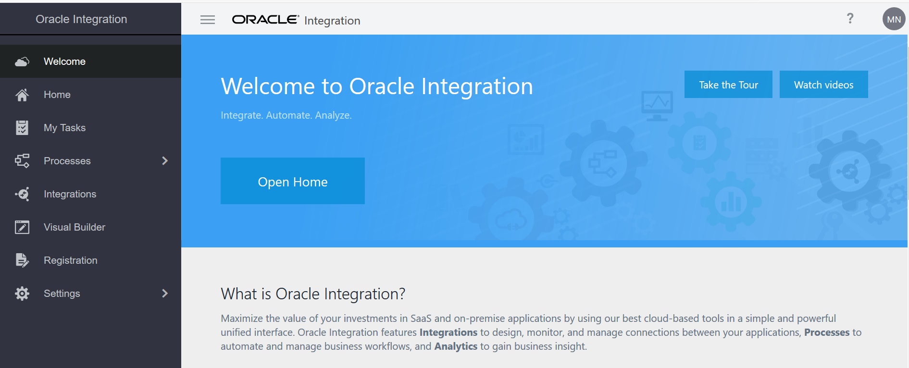


**1.2** Ir al enlace de **Integration**.

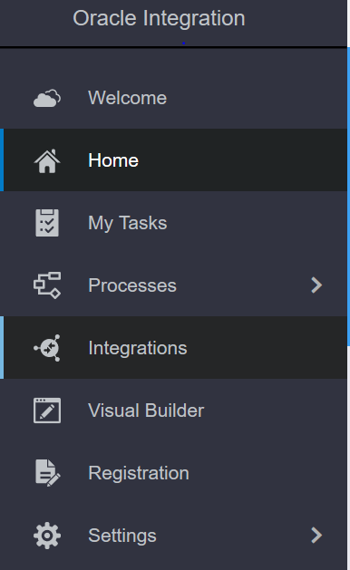

**1.3** Vaya al link **Connections** y luego **Create**.


**1.4** Búsqueda por *REST* y elija el conector.


**1.5** Introduzca el nombre `RestAdapterWorkshop_XX`, donde XX será el número entregado por el instructor. En **Role** seleccione **Trigger** y luego haga clic en **Create**.

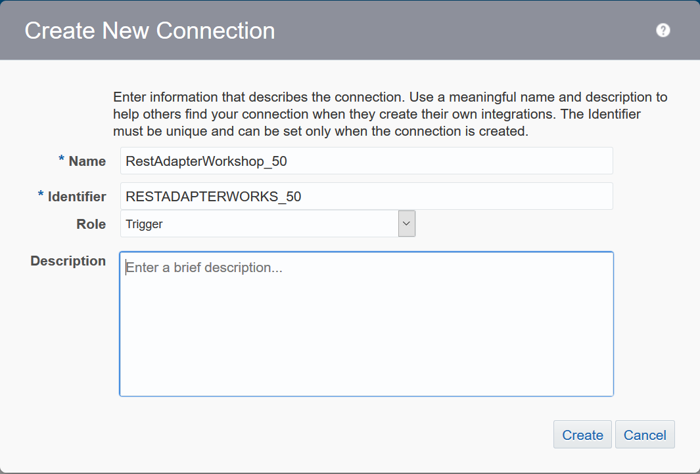


**1.6** Clic en **Save** y entonces en **Close**


### Paso 2
**2.0** Repetir los pasos 1.3, 1.4 y 1.5. Pero ahora el nombre del conector es *Oracle Sales Cloud*. En el campo Nombre de conexión, escriba `SalesCloudWorkshop_XX` (xx donde será entregado por el instructor). En **Role** selección **Invoke** y después ir en **Create**.

**2.1** En la página de configuración del conector en la sección **Connection Properties**, haga clic en **Configure Connectivity**. Configurar la conexión utilizando la dirección URL de la *OSC - Oracle Sales Cloud*. Para los ajustes necesarios, consulte el [link](https://docs.oracle.com/en/cloud/paas/integration-cloud/sales-adapter/prerequisites-creating-connection.html#GUID-8AF6BDD4-A711-480E-B71F-FAD062024A57).


**2.1.1** Llenado de Servicios **OSC Services Catalog WSDL URL**  con la información que recogió el elemento de enlace de los servicios en la nube de ventas o utilizar esto: `https://testingapplication.com/fscmService/ServiceCatalogService?WSDL` y reemplazar testingapplication.com para su dominio entorno Oracle Sales Cloud - OSC.

**2.1.2** Rellenar **Interface Catalog URL (optional)** con la información que recogió el elemento de enlace de los servicios en la nube de ventas o utilizar esto: `https://testingapplication.com/helpPortalApi/otherResources/latest/interfaceCatalogs` y reemplazar el testingapplication.com dominio de su entorno Oracle Sales Cloud - OSC.

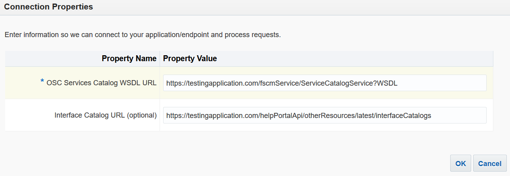

**2.1.3** En la sección **Security**, haga clic en **Configure Security** y rellenar el nombre de usuario y contraseña de un usuario OSC. Haga clic en **OK**


**2.2** Ahora haga clic en **Test**y esperar hasta que la  *Oracle Integration Cloud* realizar la prueba y validar la conexión a el OSC. Después de terminar la prueba, tenga en cuenta el porcentaje de etiqueta, debe aparecer 100% como se muestra a continuación:


**2.3** Con el porcentaje de etiqueta 100% Haga clic en **Save** y **Close**.


### Paso 3
**3.1** En la esquina izquierda de la pantalla y luego clic **Integrations** en la esquina derecha de la pantalla **Create**. Elija la opción de **Basic Routing**.


**3.2** Rellene el nombre de la integración como `CreateOppOSC_XX` donde XX es el número dado por el instructor. A continuación, haga clic en **Create**.


**3.3** En la siguiente pantalla, busque en el jardín derecho (1) en la conexión `RestAdapterWorkshop_XX` (2), arrástrelo a la de *Drag and Drop a Trigger* (3).

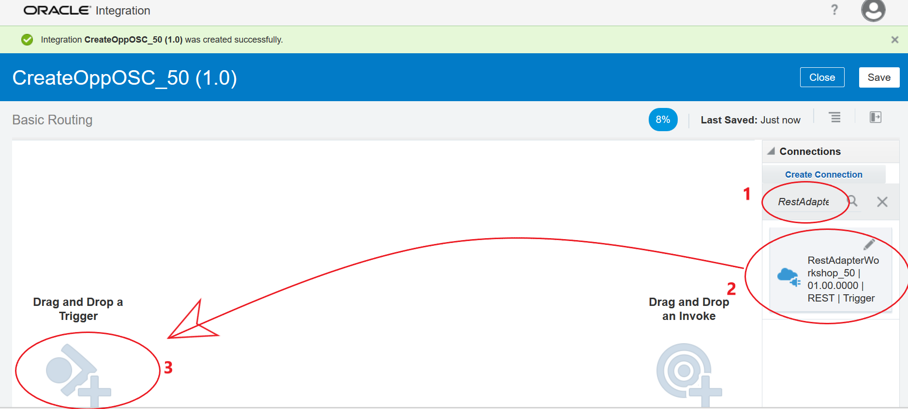

**3.4** Ajuste del adaptador REST

**3.4.1** Complete los campos como imágenes a continuación:

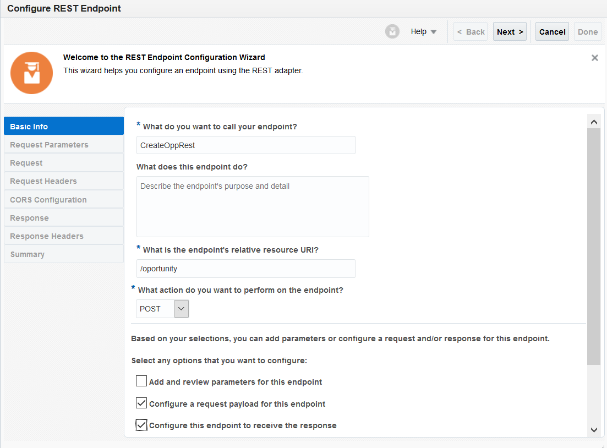

**3.4.2** Clic **Next >**

Ahora el campo **Select the request payload format** seleccionar **JSON Sample** la opción de la muestra y haga clic en línea **<<< inline >>>**

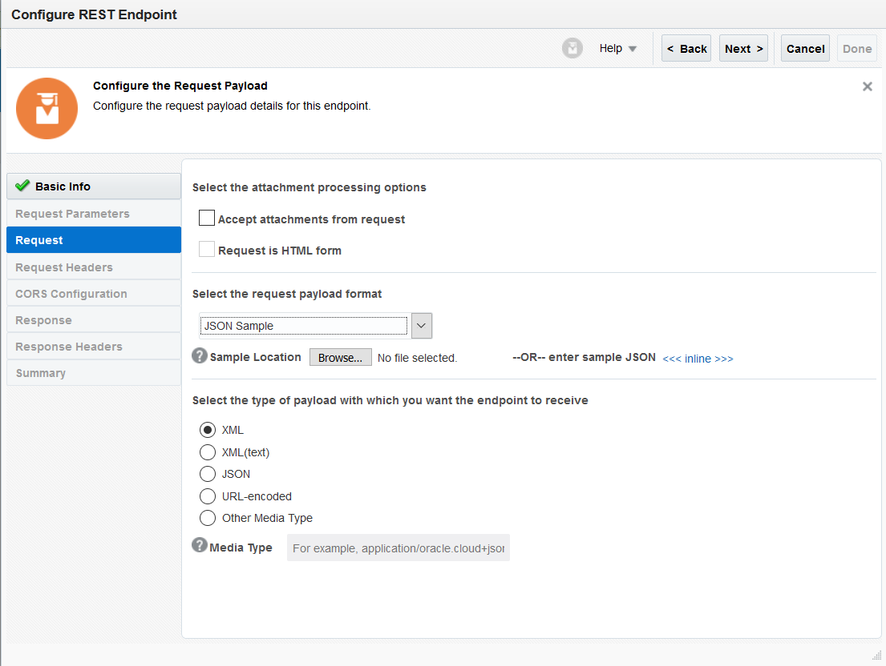

**3.4.2.1** En el campo **Enter Sample JSON** introduzca el código de abajo, a continuación, haga clic en OK:

```json
{
	"opportunityName" : "Opportunity Name",
	"loginOwner" : "amanda.bell",
	"winProbability" : 10
}
```

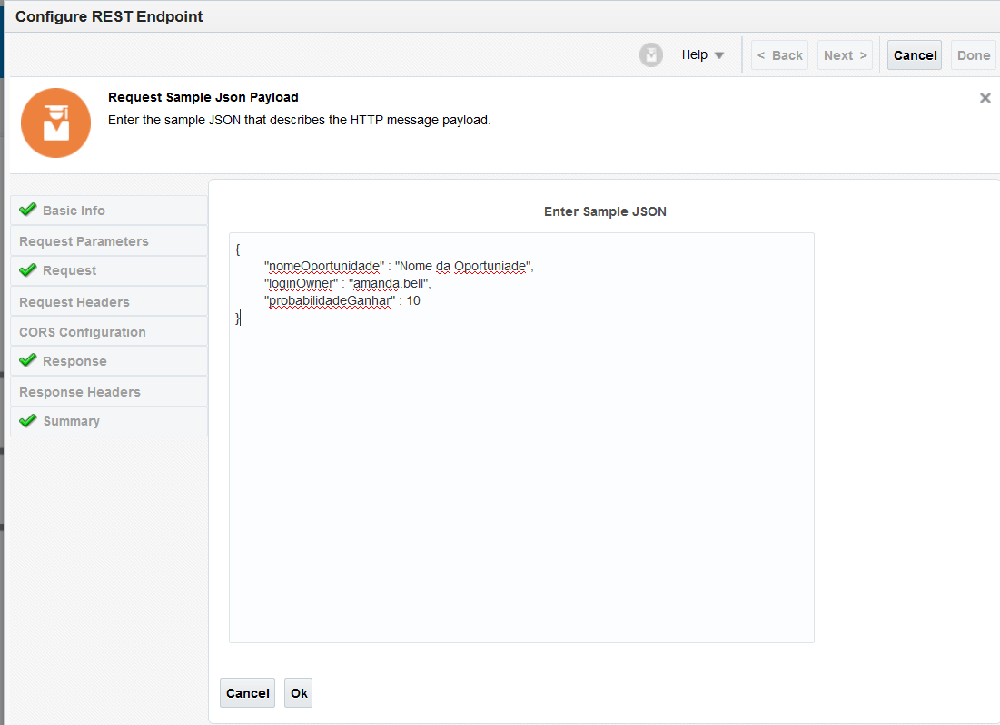


**3.4.3** Selección de **JSON** como tipo de carga útil que el punto final recibirá y luego haga clic en **Next >**


**3.4.4** Ahora el campo **Select the response payload format** seleccionar **JSON Sample** y despues haga clic en línea **<<< inline >>>**

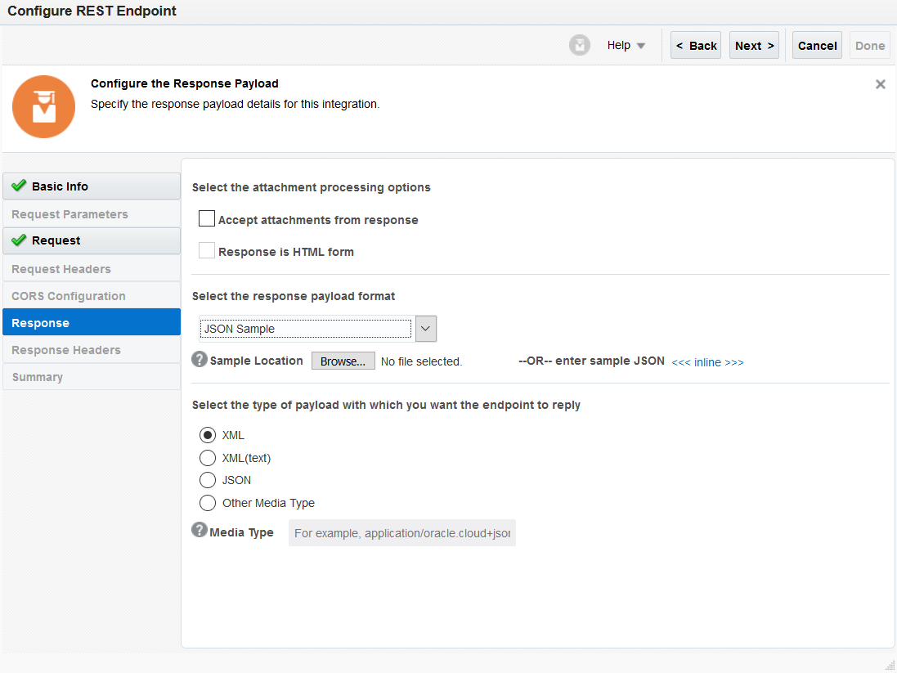

**3.4.4.1** En el campo **Enter Sample JSON** introduzca el código de abajo, a continuación, haga clic en OK:

```json
{ "opportunityId" : "123095" }
```


**3.4.5** Selección de **JSON** como tipo de carga útil que el punto final responderá y haga clic en **Next >**

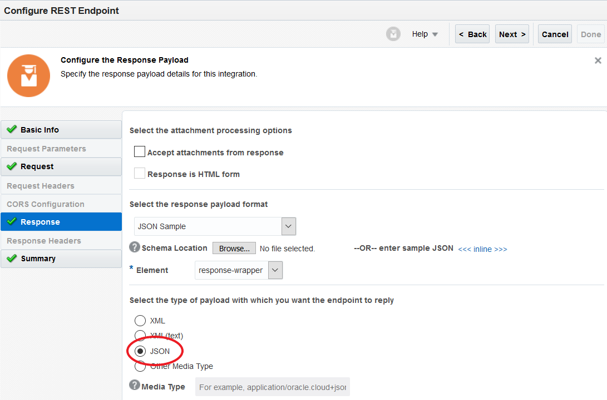

En la pantalla *Summary*, compruebe que los ajustes están correstas en **Endpoint Summary**, y luego haga clic en **Done**


**3.5** En la pantalla principal, busque en el jardín derecho (1), la conexión `SalesCloudWorkshop_XX` (2), arrástrelo a la *Drag and Drop a Invoke* (3).


**3.6** Configuración del adaptador SalesCloud

**3.6.1** Rellene los campos como imágenes a continuación y haga clic en **Next >**.

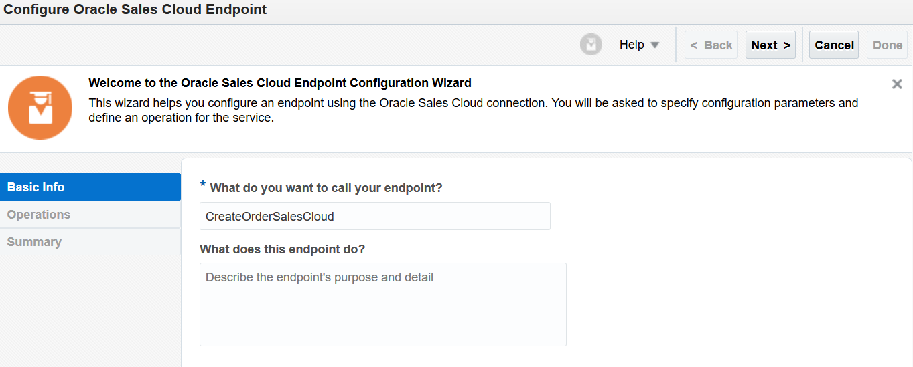


**3.6.2** Configurar los campos como se indica a continuación:

| Passo  | Campo  | Valor  |
| ------------ | ------------ | ------------ |
| 1 | Browse By  | Business Objects  |
| 2 | Select a Business Object  | Opportunity : OpportunityService  |
| 3 | Select the Operation to Perform on the Business Object | createOpportunity |

e despues clic en **Next >**.


**3.6.3** Clic en **Done**


**3.7** Configuración de una llamada para recuperar el ID de *Owner* de la oportunidad:

**3.7.1** La pantalla de la derecha buscar de nuevo mediante la conexión `SalesCloudWorkshop_XX` y arrastre a la de la izquierda **+**, como se muestra en la figura siguiente:


**3.7.2** Después de abrir la pantalla de configuración de esta integración puso el nombre de la integración como `GetUserByUsername` y luego haga clic en **Next >**


**3.7.3** Seleccionar los campos como la información a continuación:

| Campo  | Valor  |
| ------------ | ------------ |
| Browse By  | Services  |
| Select a Service | ResourceService  |
| Select the Operation to Perform on the Business Service | findResource  |


Haga clic en **Next >**


**3.8** Mapeo de la llamada para recuperar el ID de la Oportuniade.

*Si tiene alguna pregunta sobre cómo hacer el mapeo ver el enlace que se encuentra en la sección Requisitos previos: El uso de la asignación. [[1]][mapeamento]*

**3.8.1** Haga clic en el mapeo de más a la izquierda de la pantalla y luego +, como se muestra a continuación:


**3.8.2** Salir a navegar en el lado derecho de la pantalla, abriendo el campo para obtener el campo de **attribute** como la imagen de abajo. Haga clic en el campo **attribute** para abrir la pantalla de asignación de atributos.


**3.8.3** En el lugar indicado en rojo poner el valor `Username`, haga clic en **Save** y después **Close**:


**3.8.4** Repita los pasos 3.8.1 y 3.8.2 para el campo **operator**. El valor será `=`

**3.8.5** Finalmente arrastre usando el ratón, campo  `loginOwner` para el campo de **value**. Su pantalla de mapeo debe parecerse a la siguiente pantalla:


**3.8.6** Haga clic en **Validate** después  **Close**

**3.9** Mapeo de la llamada a la conexión Sales Cloud:

*Si tiene alguna pregunta sobre cómo hacer el mapeo ver el enlace que se encuentra en la sección Requisitos previos: El uso de la asignación.[[1]][mapeamento]*

**3.9.1** Haga clic en el mapa más al centro y por encima de la pantalla y luego **+**, como se muestra a continuación:

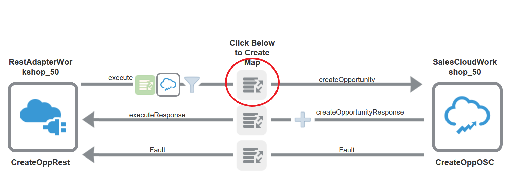

**3.9.2** Hacer el mapeo arrastrando los campos de izquierda a derecha como se muestra a continuación:

    CurrencyCode = USD (campo fijo)
    opportunityName ===> Name
    winProbability ===> WinProb
    PartyID ===> OwnerResourcePartyId


**3.9.3** Haga clic en **Validate** después **Close**

**3.10** Retorno Mapeo de la llamada de Sales Cloud

**3.10.1** Haga clic en el mapa más al centro y debajo de la pantalla, luego **+**, como se muestra a continuación:


**3.10.2** Hacer mapeo arrastrando los campos de izquierda a derecha como se muestra a continuación:

    OptyId ===> opportunityId


**3.10.3**Haga clic en **Validate** después **Close**

**3.11** Seguimiento de llamadas

**3.11.1** Clic en **Tracking**, como se muestra a continuación:


**3.11.2** Arrastre las variables de la izquierda para los campos de la derecha, como se muestra a continuación:


**3.11**Después de esto, asegúrese de que el campo de la actividad porcentaje es igual al 100%, si hace clic en **Save** y **Close**


### Paso 4

**4.1**Activar la integración y permitir el seguimiento de la siguiente manera:


Habilitar las opciones como a continuación:


**4.2** Tras la activación, recuperar el *endpoint* a través del icono de engranaje, mantener esta enpoint porque va a utilizar en los próximos pasos.


Además de la marcha, después de activar un mensaje aparece con el punto final.


**4.3** Abrir el software de post, se puede descargar [aquí](https://www.getpostman.com/ "Postman"). Llene la información de la siguiente manera:

El método que se debe poner **POST** y **URL** debe ser la URL recuperó en 4.2.


**4.4** Haga clic en la ficha **Authorization** y rellenar los campos: **Type** debe ser **Basic Auth** y el **Username** y **Password** deben utilizarse para que utilizó para iniciar sesión en el Oracle Integration Cloud - OIC. 


**4.5** Haga clic **Body** y seleccione la opción **raw** y colocar el JSON prueba prima: 
```json
{
	"opportunityName" : "Opportunity name",
	"loginOwner" : "amanda.bell",
	"winProbability" : 10
}
```


**4.5** Haga clic en **Send** y esperar la respuesta. Debe contener una respuesta JSON, como la siguiente imagen:


**4.6** Retorno a la nube de integración de Oracle - OCI y haga clic en **<**. 

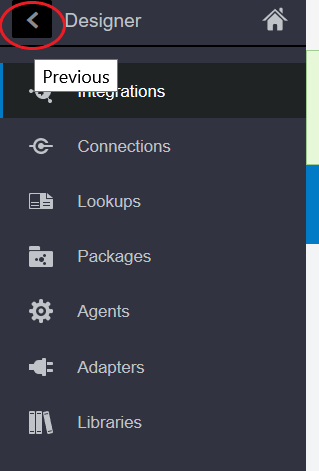

**4.7** Haga clic en **Monitoring** -> **Tracking**. Tenga en cuenta que el mensaje aparece en verde. Haga clic en el mensaje y tomar nota de los progresos realizados por 


Detalles de las llamadas realizadas, tenga en cuenta que el camino que hizo el mensaje es de color verde. Explorar las opciones para comprobar los parámetros que fueron objeto de trata. 


Ahora ya está listo para ir a la [**Lab2 Desarrollo de un proceso de negocio utilizando Proceso Cloud Service - OCI y la integración con Oracle Sales Cloud. Cloud**](https://github.com/matheus-neia/Oracle/blob/master/paas4saas/lab2-es.md).

[mapeamento]: https://github.com/matheuzum/Oracle/blob/master/paas4saas/lab1.md#pr%C3%A9-requisitos "Uso de lo mapeo"