# Lab 2 - Desarrollo de un proceso de negocio usando Process Cloud Service y integrando con Oracle Sales Cloud
## Objetivos
- Paso 1: Crear Proceso de Negocio
- Paso 2: Crear integración con el Integration Cloud
- Paso 3: Análisis de una aplicación creada y una implementación de tabla de decisión
- Paso 4: Hacer una prueba y deploy
- Paso 5: Configurar usuarios para nueva aplicación
- Paso 6: Crear una tarea usando *My Tasks*

## Requisitos previos
Leer el links abajo:
- Hacer el Lab 1
- Tener acceso OIC Enterprise Edition
- Ver el material: [How to use mapping](https://www.youtube.com/watch?v=7sjLVKJeCrU "Explore la Simple Approval Process Application")

### Paso 1
**1.1** Ingrese a su cuenta en la nube de Oracle Integration Cloud. Link será entregado por el instructor.

**1.2** Ir al opción **Processes** -> **Process Applications** -> **Create** -> **Import la Application**

**1.3** Hacer upload del archivo [CreateOpp.exp](files/CreateOpp.exp) en el campo **Name** y complete con `CreateOpp_XX` (Donde XX será entregado por el instructor).

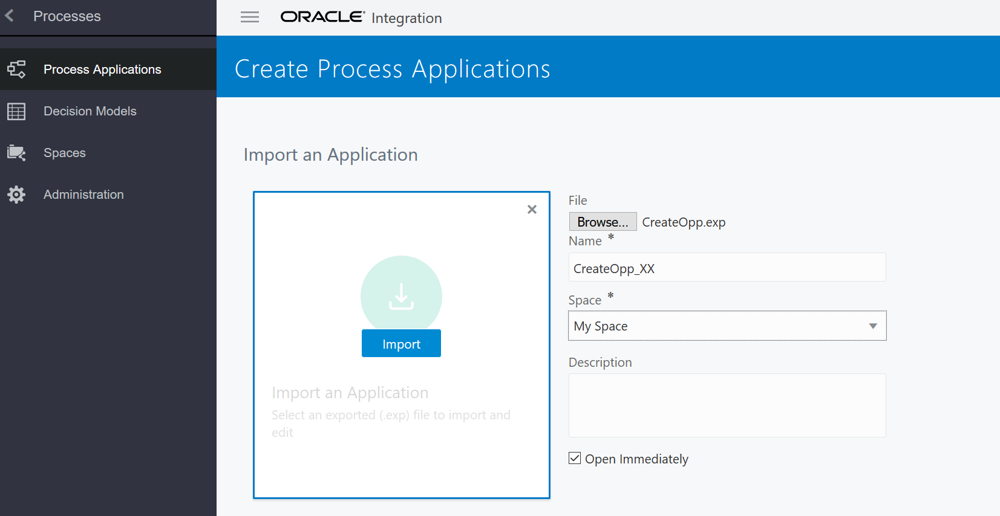

Pantalla después de la importación

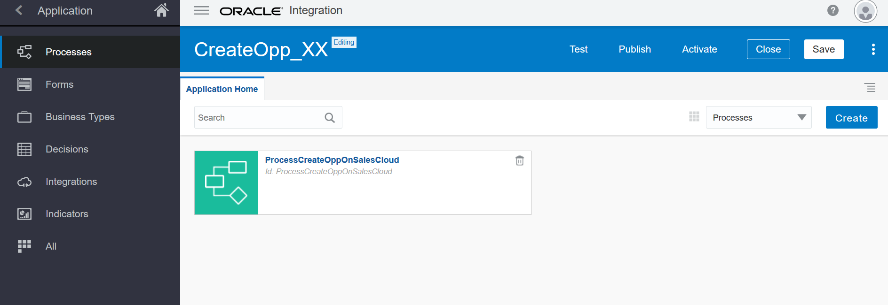

### Paso 2

**2.1** En el lado izquierdo de la pantalla seleccionar la opción **Integrations** -> **Create** -> **Use la Integration**

**2.2** Seleccione la integración que usted hay creado en el Lab1, en mi ejemplo es la integración llamada `CreateOppOSC_XX` donde XX es un ejemplo, seleccione la opción con el número que el instructor te fornece y después clic en **Create**. 

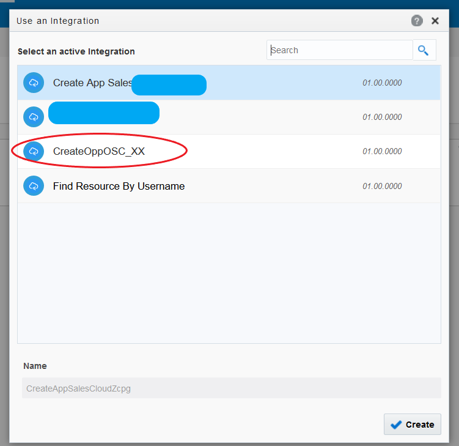

Resultado después de la creación

### Paso 3

**3.1** En el lado derecho de la pantalla seleccionar la opción **Process** -> **ProcessCreateOppOnSalesCloud**.

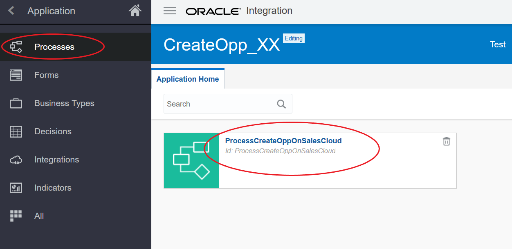

**3.2** Hacer una revisión del proceso creado, elle contempla muchos ejemplos con los componentes *User Task* y *Decision*. Tenga en cuenta las pantallas para entender como fue desarrollado. 

**3.3** En el lado derecho de la pantalla seleccionar la opción **Decisions** -> **DecisionOppByPrice**.

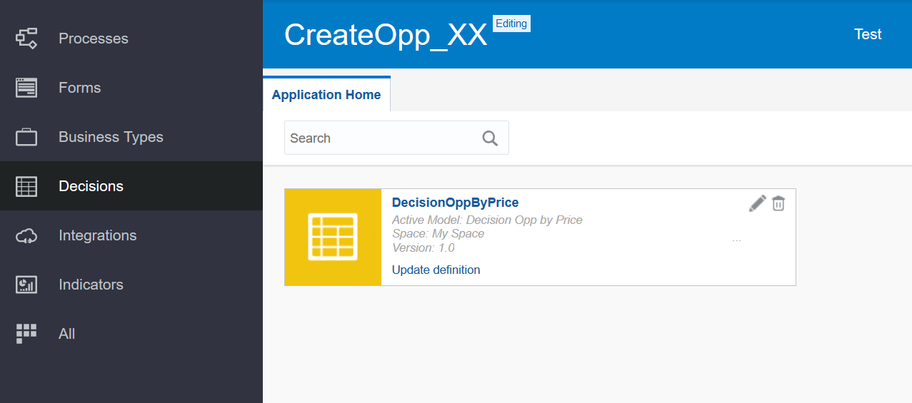

**3.4** Tomar nota de las implementaciones de la tabla de decisión. 
> informaciones de tablas de decisiones en la documentación: [Decision Models](https://docs.oracle.com/en/cloud/paas/integration-cloud/user-processes/create-decisions.html)

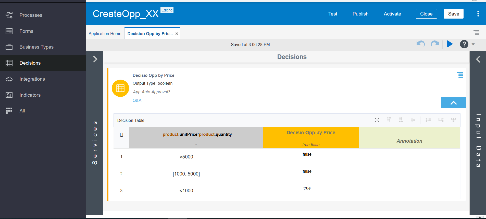

### Paso 4

**4.1** Regrese a proceso de negocio desarrollado. En el lado derecho de la pantalla seleccionar la opción **Process** -> **ProcessCreateOppOnSalesCloud**. 

**4.2** Clic en el elemento *Call OIC Integration*, después en el ícono de opciones -> **Open Properties**

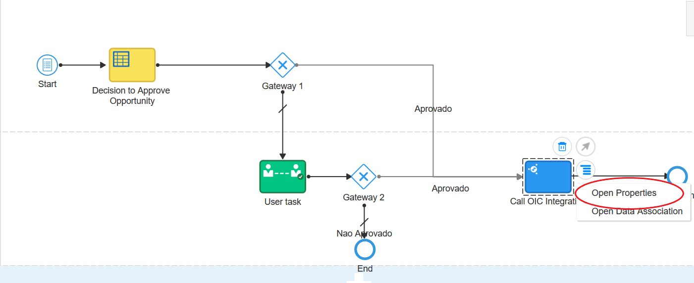

**4.3** En el campo **Integration** seleccionar la integración que usted hay creado en el paso 2.2. en el mi caso es la integración llamada `CreateOppOSCXX` 

**4.4** Clic en el ícono de opciones en la derecha de la pantalla y después en **Validate Application**. 

Si todos los ocho hay una apariencia similar como un *The last CreateOpp_XX application validation was successful* en verde. Clic en el ícono de prueba, conforme imagen abajo. De lo contrario, corregir los errores que aparecen.

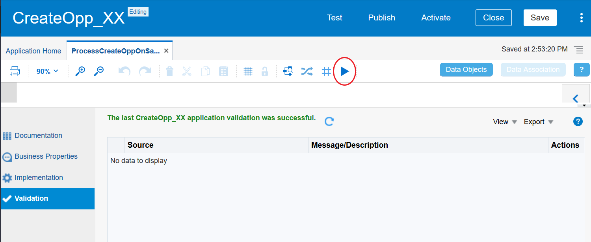

**4.5** Clic en los íconos, conforme imagen abajo, para iniciar la prueba.

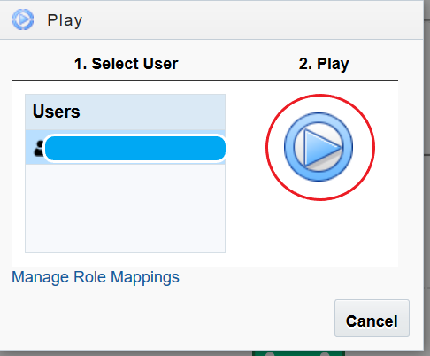

**4.6** Rellene los campos conforme imagen abajo y después clic en **Submit**

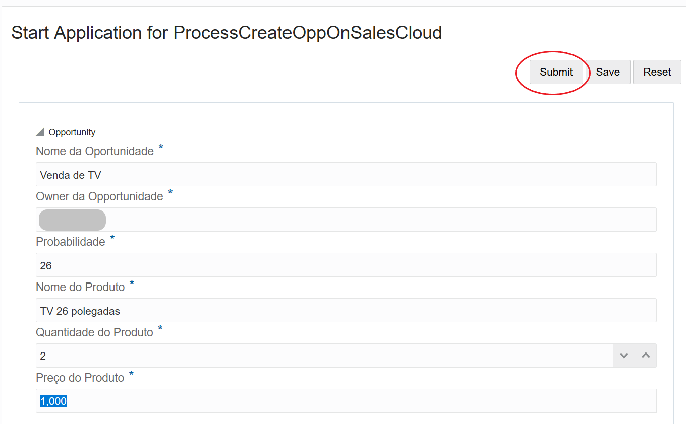

**4.7** El proceso va a caminar y deberá parar en la activad **User Task**. Cuando el proceso parar en la activad clic en el ícono indicado y después clic en **APROVADO**, para aprobar la creación de la oportunidad.

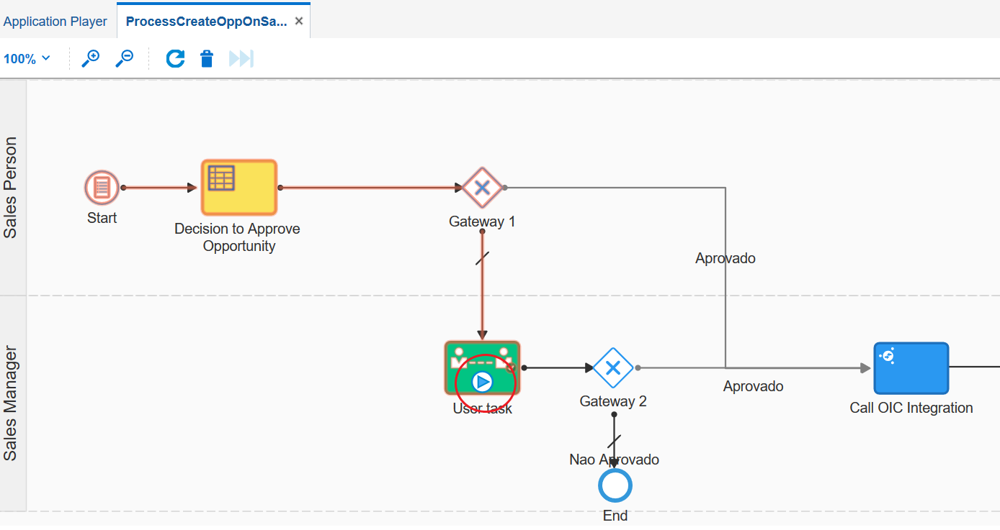

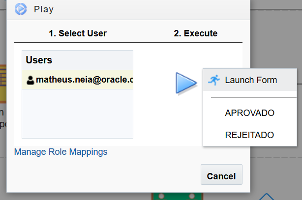

**4.8** Caso la línea roja de lo proceso mantenerse parado, usted use el botón de *refresh* conforme pantalla abajo.

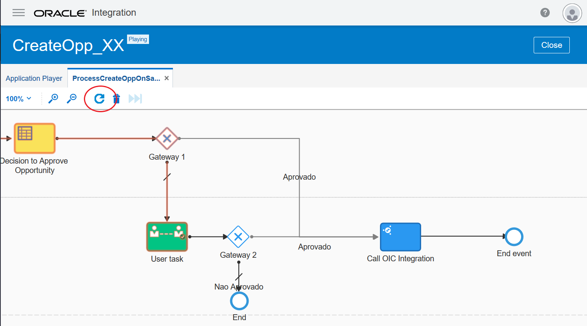

**4.9** Despues la línea roja caminar hasta el final de lo proceso, como imágenes a continuación, clic en el ícono indicado para terminar el prueba.

**4.10** Ahora que el proceso funciono precisamos guardar y publicar una versión para *deploy*. Entonces clic en **Save**

**4.11** Clic en **Publish** (1), seleccionar la opción **Make snapshot** (2) y rellene la versión con `V_XX` y el campo **Comment** (3), después clic en **Publish**. (4)

**4.12** Ahora vamos a activar la aplicación y realizar el *deploy*. Para eso clic en **Activate** (1). después seleccionar la versión publicada en el paso 4.11 (en mi ejemplo es la V_XX)(2), después clic en **> Validate** (3).

Clic en **> Options** y rellene la pantalla de **Activate Options** como imágenes a continuación.

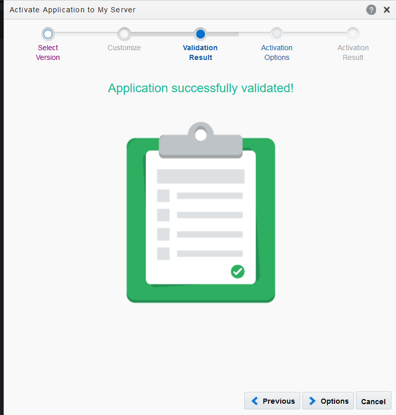

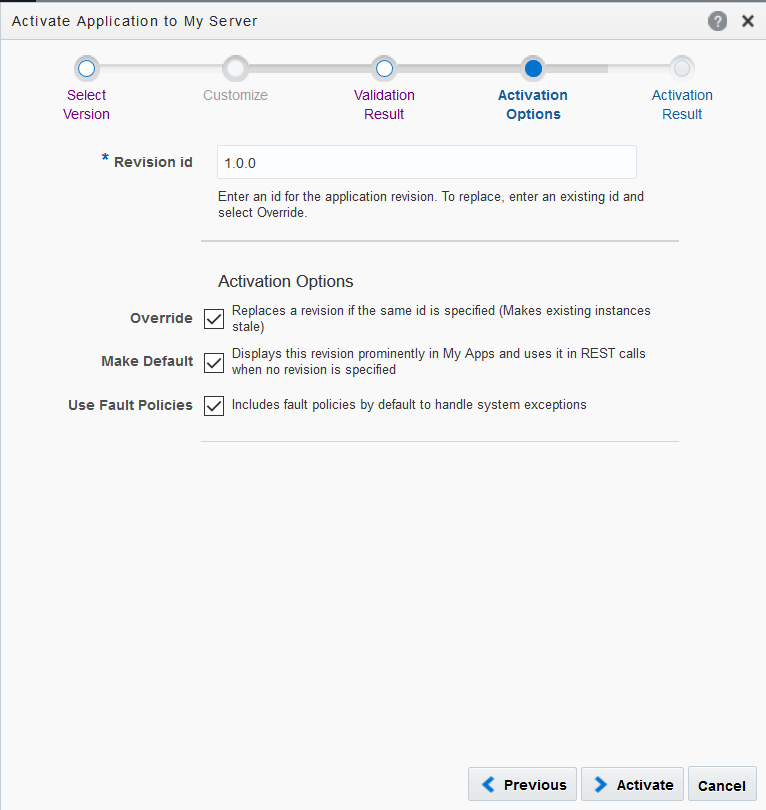

Confirme se la versión fue publicada y clic en **Close**.

### Paso 5

**5.1** Ahora vamos a seleccionar los usuarios que tienen el papel de vendedor, gerente de ventas, revisor de lo proceso y propietario de lo proceso. Para eso ir a la página de inicio de lo Oracle Integration Cloud y después clic en **My Tasks** -> **Workspace** -> **Administration**.

Clic en **Workspace** 

Clic en **Administration**

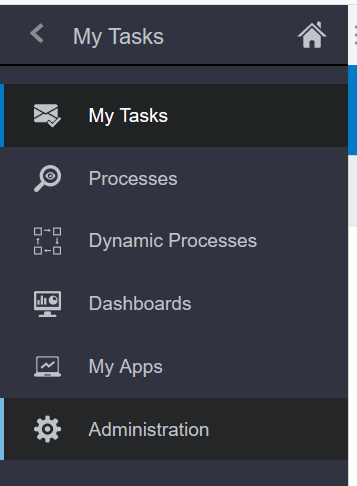

**5.2** Ahora busque la aplicación que creaste en el paso 4. Para eso siga los siguientes pasos: **Manage Roles** (1) -> Busque usando el nombre de la aplicación (2), mi ejemplo es `CreateOpp_XX` -> Clic en Pesquisar (3)

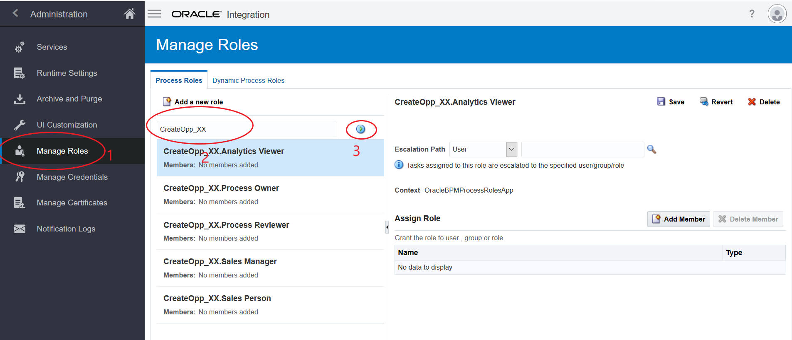

**5.3** Agregar un usuario para el papel `CreateOpp_XX.Sales Person`. Para eso siga los pasos clicando en el siguiente orden: **CreateOpp_XX.Sales Person** (1) -> **Add Member** (2) -> Busca tu usuario que usted está usando en el OIC (3) -> seleccionar tu usuario (4) -> **OK** (5) -> **Save** (6) 

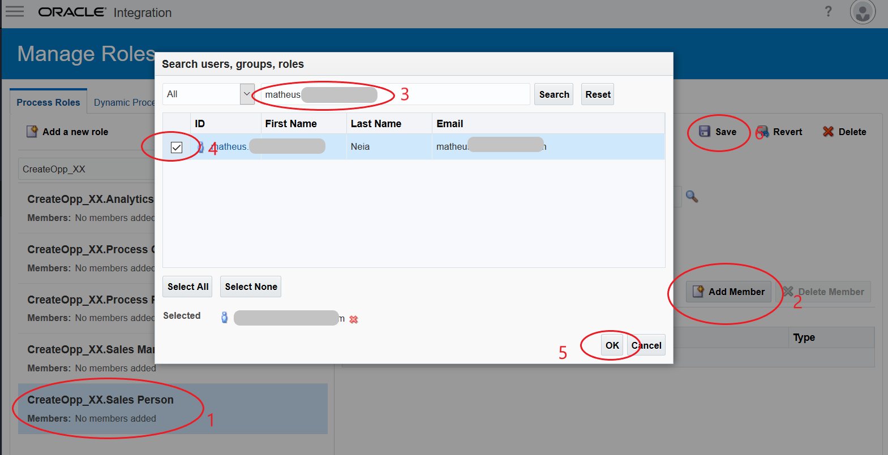

**5.4** Ahora repita el paso 5.3, usando el mismo usuario, para los demás papeles: 
- CreateOpp_XX.Sales Manager
- CreateOpp_XX.Process Reviewer
- CreateOpp_XX.Process Owner
- CreateOpp_XX.Analytics Viewer

### Paso 6

Vamos a crear una oportunidad, ahora usando la aplicación en producción.

**6.1** Para eso ir hasta la página inicial de lo Oracle Integration Cloud y seleccionar **My Tasks** -> **Initiate Request**.

Después clic en el nombre de tu aplicación que deberá estar con el nombre `Create Opportunity(1.0.0)`, fique con el ratón encima de lo ícono para usted verificar se es la tu aplicación.

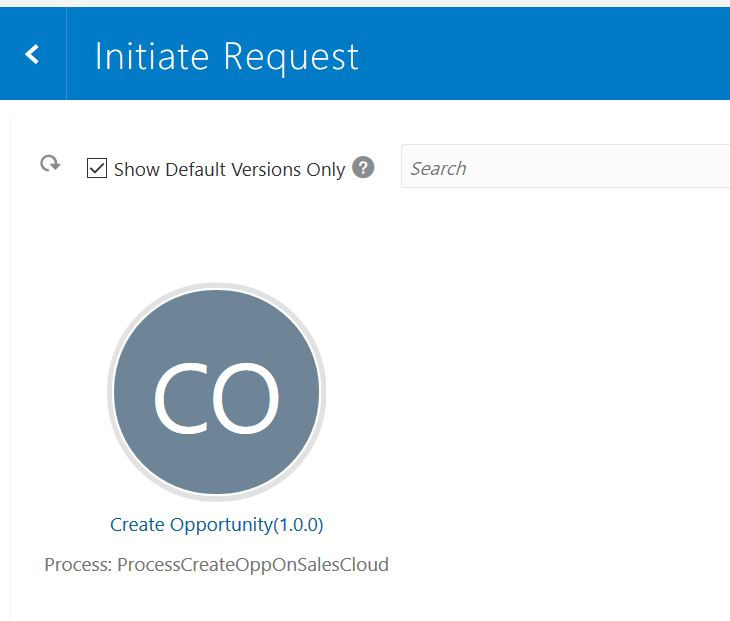

**6.2** Rellene el formulario con los datos, conforme imagen abajo. Para el campo **Quantidade de lo Produto** rellene 10 y **Preço de lo Produto** rellene con 15 y después clic en **Submit**. 

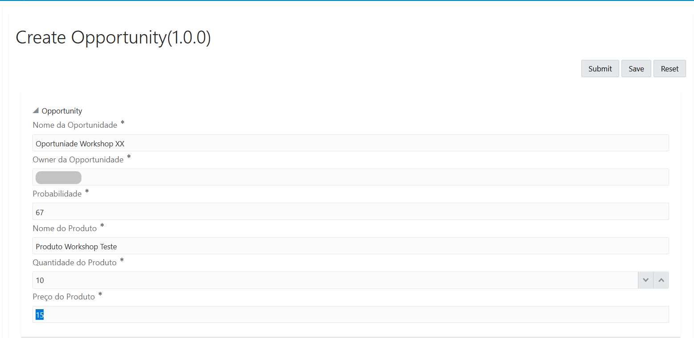

**6.3** Crear otra solicitud, pero ahora con los valores, conforme pantalla abajo. Para el campo **Quantidade de lo Produto** rellene 300 y **Preço de lo Produto** rellene con 600 y después clic en **Submit**. 

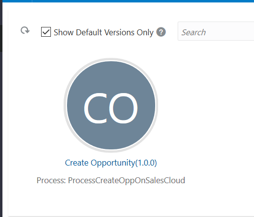

**6.4** Clic en **Workspace** y después clic en el nombre de lo proceso, mi caso es `CreateOpp_XX`.

Clic sobre lo nombre de lo proceso `CreateOpp_XX`

Clic en **APROVADO**

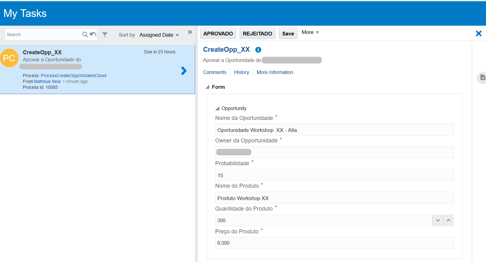

**6.5** Ir hasta la página inicial de Oracle Integration Cloud y después menu **Integrations** -> **Monitoring** -> **Tracking** y nota las dos solicitudes para el Oracle Sales Cloud con suceso. 

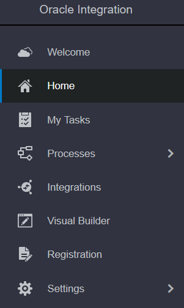

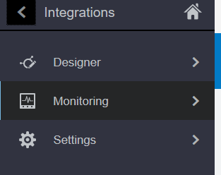

Las dos llamadas de lo proceso llamaran el Integration que realizado la operación de registro de la oportunidad en Oracle Sales Cloud con suceso.

Ahora usted está listo para hacer los Labs:
- [**Lab3: Desarrollo de una pantalla móvil utilizando Oracle Mobile Cloud Service - MCS**](https://github.com/matheus-neia/Oracle/blob/master/paas4saas/lab3-es.md)
- [**Lab4: Desarrollo de una pantalla utilizando Oracle Visual Builder**](https://github.com/matheus-neia/Oracle/blob/master/paas4saas/lab4-es.md)