# Lab 3 - Desarrollo de una pantalla móvil utilizando Oracle Mobile Hub - OMH

## Objetivos
- Paso 1: Crear un conector con el Process Cloud
- Paso 2: Desarrollar una API Rest usando Javascript, para llamar el conector
- Paso 3: Crear una aplicación Mobile - Oracle MAX
- Paso 4: Hacer deploy y prueba de la App

## Pré-Requisitos
Leer el Links abajo:
- Hacer el Lab 1 y Lab 2
- Tener acceso a OIC Enterprise Edition
- Tener acceso a Oracle Mobile Hub
- Instalar la app Oracle MAX en tu celular - [Installing the MAX App](https://docs.oracle.com/en/cloud/paas/mobile-hub/build-low-code/building-and-testing-your-apps.html#GUID-60364DA2-2464-4C4F-ADB3-C845E1B6E591)
- Veer el Vídeo [An Introduction to Mobile Application Accelerator (MAX)](https://docs.oracle.com/en/cloud/paas/mobile-hub/build-low-code/what-is-mobile-application-accelerator.html#GUID-CD0DA584-C21A-4FB3-A284-4EF75819B138)

### Paso 1
**1.1** Ingrese a su cuenta Oracle Ingration Cloud, cuenta utilizada en Lab 1 y Lab 2.

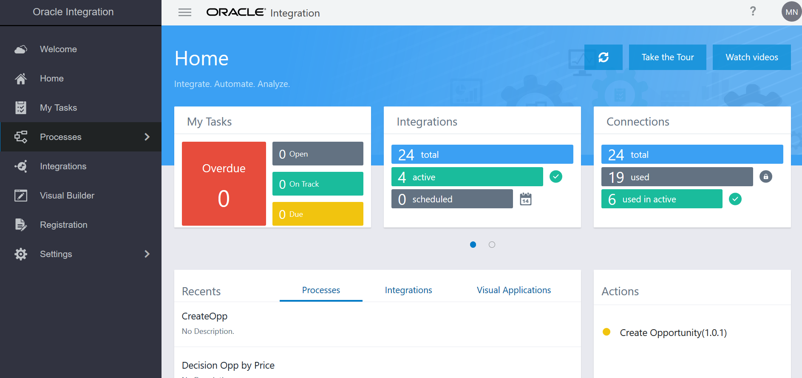

**1.2** Clic en **Processes** -> **Process Applications** -> **Activate**


**1.3** Su aplicación creada en lab 2 deberá estar allí. Clic en **Actions** (1) -> **Web Services** (2)


**1.4** Copie la URL de la pestaña **Exposed** guarde esta url en un notepad. Mi ejemplo es `https://xxxxxxx.oraclecloud.com/soa-infra/services/oracleinternalpcs/CreateOpp_XX!1.0.0*xxxxxxxx/ProcessCreateOppOnSalesCloud.service?WSDL`

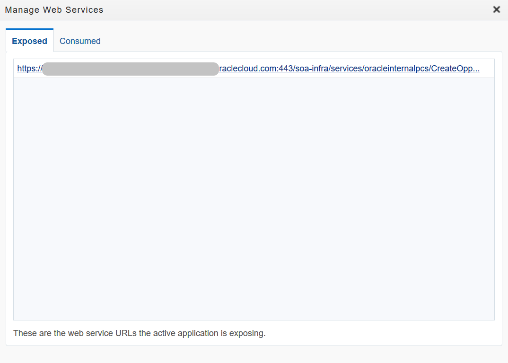

**1.5** Ingrese en tu cuenta **Oracle Mobile Cloud Hub**. Link será entregado por el instructor.


**1.6** En menu a izquierdo seleccionar la opción **Development** -> **Connectors** 


**1.7** Clic en **+ New Connector** -> **SOAP**


**1.8** Rellene los campos:
- **API Display Name** como `CreateOPPConectorPCS_XX` donde  XX es el número por el instructor.
- **WSDL URL** con la url que usted guardou en el passo 1.4. 
- **Short Description** con una descripción elegido por usted. 

Ahora clic en **Create**. 


En la siguiente pantalla confirme tuyas informaciones y clic en **>**.

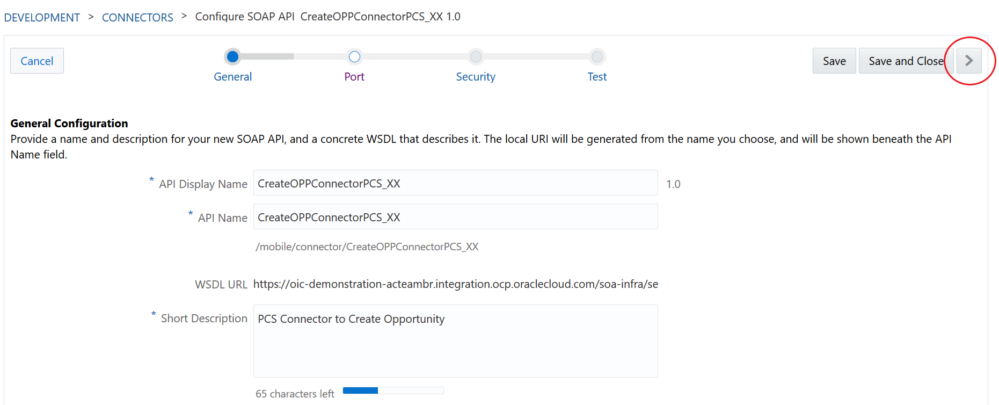

**1.9** Seleccione a política de seguridad con nombre `oracle/http_basic_auth_over_ssl_client_policy` y después agregue la **csf-key**, para eso clic en el ícono llave, abajo a derecha de la pantalla.

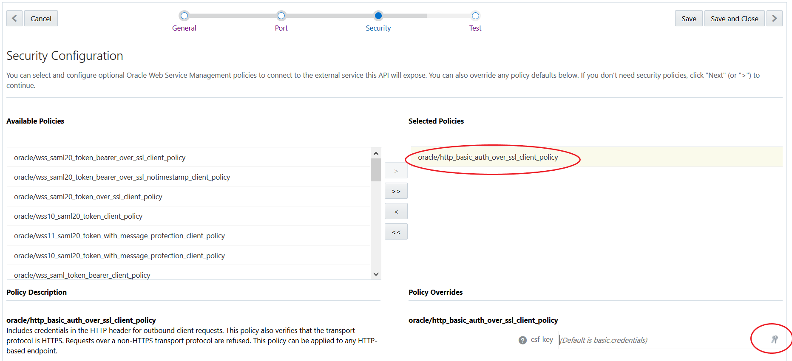

**1.10** En la pantalla **Select or Create a New API Key** clic en **Add** y después rellene los campos:
- **Key Name** con `PCS_TTC_XX` donde  XX es el número entregado por el instructor.
- **Short Description** con `PCS_TTC_XX` donde  XX es el número entregado por el instructor.
- **User Name** con el usuario que usted utiliza para conectar en el Oracle Cloud.
- **Password** con a contraseña que usted utiliza para conectar en el Oracle Cloud.

Clic en **Save** y después **Select**, ir para a siguiente pantalla, pantalla de prueba, clic en **>**.

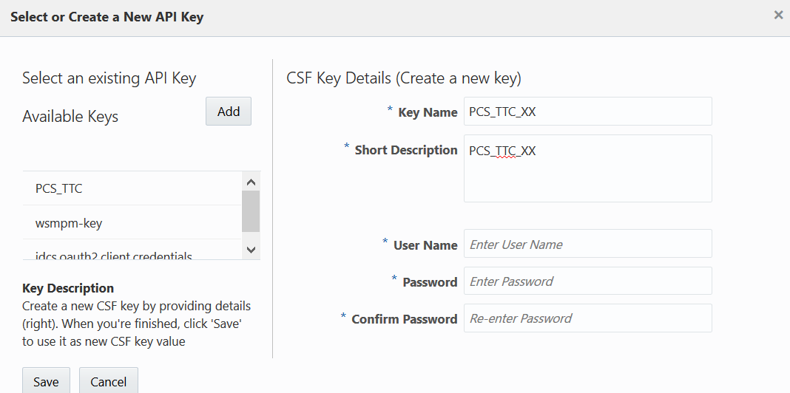

**1.11** Rellene el campo **HTTP Message Body** con el siguiente código:

```json
{
   "Header": null,
   "Body": {
      "start": {
         "formArg": {
            "Opportunity": {
               "opportunityName": "opportunityName45",
               "owner": "owner46",
               "winProb": "10",
               "productName": "productName48",
               "productPrice": 0,
               "productQty": 0
            }
         }
      }
   }
}
```

En los campos de autenticación seleccionar en **Backend** la opción `bots_samples` y rellene con tu username y password que usted utilizo para conectar en el Oracle Cloud.


**1.12** Clic en **Test Endpoint** y espere la respuesta de la llamada hasta el Process Cloud, ella deberá regresar un status 200, algo parecido con a imagen abajo. Si da un error, intente arreglar el nombre de las variables que tu pusiste en el passo 1.11, o verique si tu login y password son correctos. De lo contrario clic en **Done**.


### Paso 2

**2.1** En la pantalla inicial de lo Oracle Mobile Hub ir en **Development** -> **APIs** -> **+ New Api** -> **Express API**.


**2.2** Vá hasta **Resources** -> **+ New Resource**.

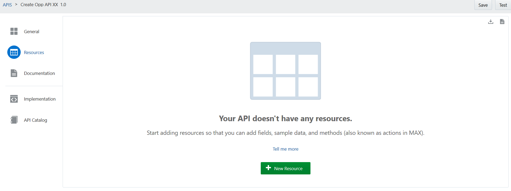

**2.3** Rellene los campos:
- **Display Name**: `Opportunity`
- **Name** : `opportunity`
- **Display Name (plural)** : `Opportunities`


Clic en **Next >**

**2.4** Clic en **Add Sample Data**.


Rellene el campo con el json abajo y ir haste la siguiente pantalla.
```json
{
	"name": "opportunityName45",
	"owner": "owner46",
	"winProb": "10",
	"productName": "productName48",
	"productPrice": 0,
	"productQty": 0
}
```


**2.5** Clic en **Finish**


Clic en **Save**


**2.6** Clic en **Implementation** y hacer el download de lo archivo de ejemplo clicando en el botón **JavaScript Scaffold**.


El archivo bajado tiene el nombre acerca de `createoppapixx.zip`. Descompacte el archivo en tu computadora, él deberá contener los siguientes archivos:

| Files  |
| ------------ |
|createoppapixx.js   |
|createoppapixx.raml   |
|package.json   |
|ReadMe.md   |
|samples.txt   |
|swagger.json   |
|toolsConfig.json  |


**2.7** Vamos a escribir la llamada de la API en Javascript.

**2.7.1** Editar el archivo `package.json` y adicione en la línea 9 el conector que creamos en el passo 1. Él deberia parecer con el código abajo:

```json
{
  "name" : "createoppapixx",
  "version" : "1.0.0",
  "description" : "Create Opp API XX",
  "main" : "createoppapixx.js",
  "oracleMobile" : {
    "dependencies" : {
      "apis" : { },
      "connectors" : { "/mobile/connector/CreateOPPConectorPCS_XX" : "1.0" }
    }
  }
}
```
Recuerda que **CreateOPPConectorPCS_XX** deberá ser cambiado por el nombre de lo conector que usted creado en el passo 1.8 en el campo **API Name**

**2.7.2** Editar el archivo `createoppapixx.js`. Alterar el método llamado `service.post('/mobile/custom/CreateOppAPIXX/opportunity', function(req,res) {});` de acuerdo con la imagen abajo.


Este método deberá contener el siguiente código:

```javascript
service.post('/mobile/custom/CreateOppAPIXX/opportunity', function(req,res) {
	var sdk = req.oracleMobile;
	var optionsList = {
			Header: null,
			Body: {
				"start" : {
					"formArg" : {
						"Opportunity": {
							"opportunityName": req.body['name'],
			            	"owner": req.body['owner'],
							"winProb": req.body['winProb'],
							"productName": req.body['productName'],
							"productPrice": req.body['productPrice'],
							"productQty": req.body['productQty']
						}
					}
				}
			}
		};

	sdk.connectors.post('CreateOppPCSConnectorXX', 'start', optionsList, {inType: 'json', versionToInvoke: '1.0'}).then(
		function (result) {
			res.status(result.statusCode).send(result.result);
		},
		function (error) {
			res.status(error.statusCode).send(error.error);
		}
	);
});
```

**2.7.3** Ahora guarde todos los archivos y compacte nuevamente con el nombre `createoppapixx.zip`. Con este .zip en manos hacer el upload en el Oracle Mobile Hub mediante lo link **Upload an implementation archive** de acuerdo con la pantalla abajo, después clic en **Test**.


**2.8** En la pantalla de la API clic en **Test**, si no tienes clicado en el passo 2.7.3. Clic en **POST Create Opportunity** y después en **Use Example**. Rellene el **Backend** con bots_samples y **Authentication Method** con Current User.


Ahora clic en **Test Endpoint**
	


El resultado deberá ser el status 200, parecido con la imagen abajo:


**2.9** Ahora vamos a publicar el conector y la API desarrollado, por lo tanto el Oracle MAX podrá ver la API. 

Publicarlo el conector de acuerdo con la imagen abajo:


Publicarlo la API de acuerdo con la imagen abajo:


### Paso 3

**3.1** En la pantalla inicial de lo Oracle Mobile Hub ir en **Development** -> **MAX Apps** -> **New Application**.


**New Application**

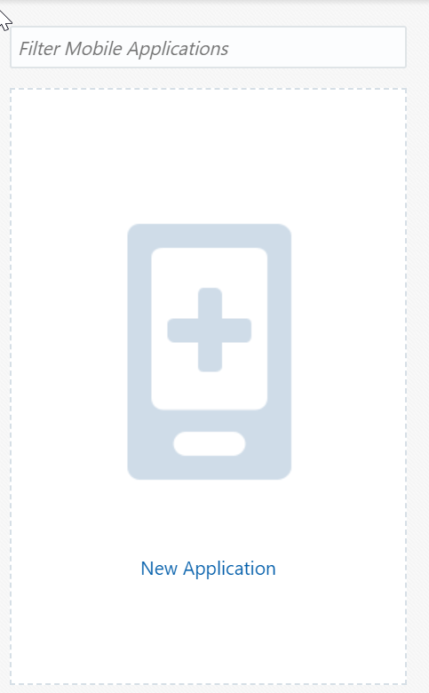

**3.2** En la pantalla de creación, siga las instrucciones de acuerdo con las pantallas abajo, hasta chegar en la opción de crear la aplicación.

- **Application Name** : `Create Opportunity XX`

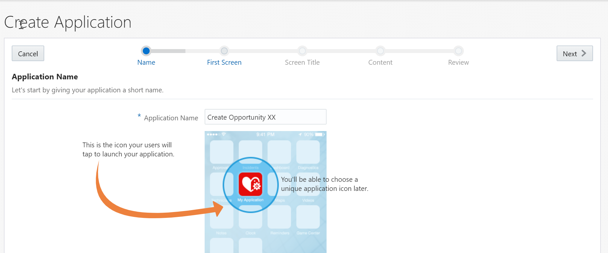

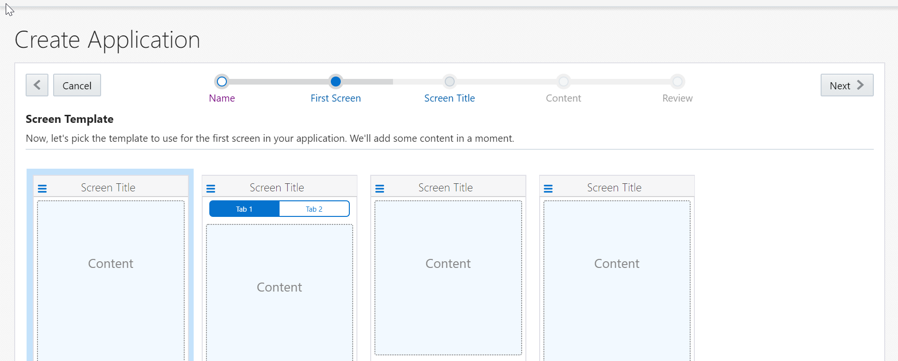

- **Screen Title** : `Opportunity`

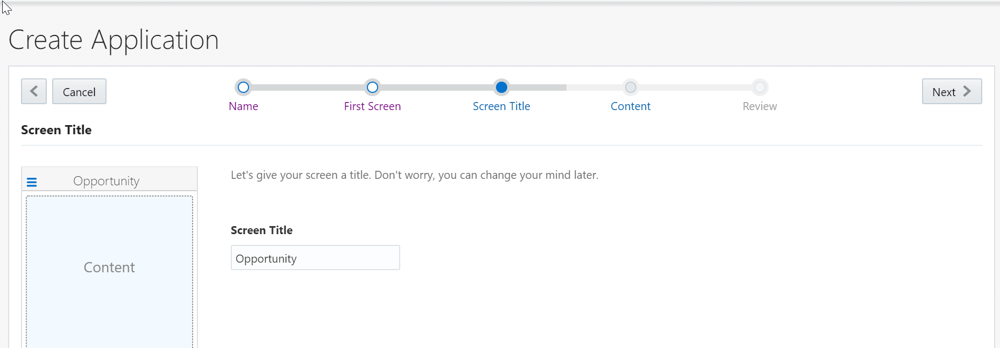


Clic en **Create**


**3.3** En la pantalla inicial de la aplicación, clic en el ícono **Data** (1) -> **Applications Services +** (2). En la pantalla que abrirá seleccione a API criada en el passo 2.9, en el mi caso es a `Create Opp API XX` (3) y por fim clic en **Select** (4).


**3.4** Clic en el ícono **Components**, arraste el component **Form** a la pantalla de lo celular.


**3.5** De lo lado derecho de la pantalla clic en **Add Data** y después selecione **Opportunity**


Seleccione **Opportunity**


**3.6** Hacer el mapeo de todos los campos de lo **Business Object** en **Form Component Fields**, arrastrando el que está en el campo **Opportunity** para **Form Component Fields**, retire apenas el **id**, por fim clic en **Finish**. 

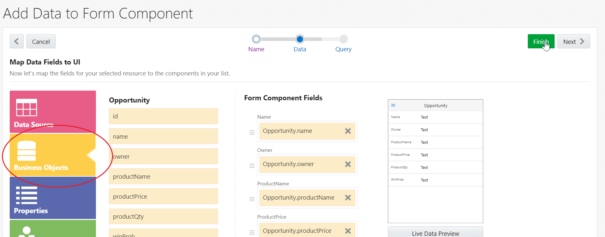

Ejemplo de como és la pantalla despues de clicar en Finish:

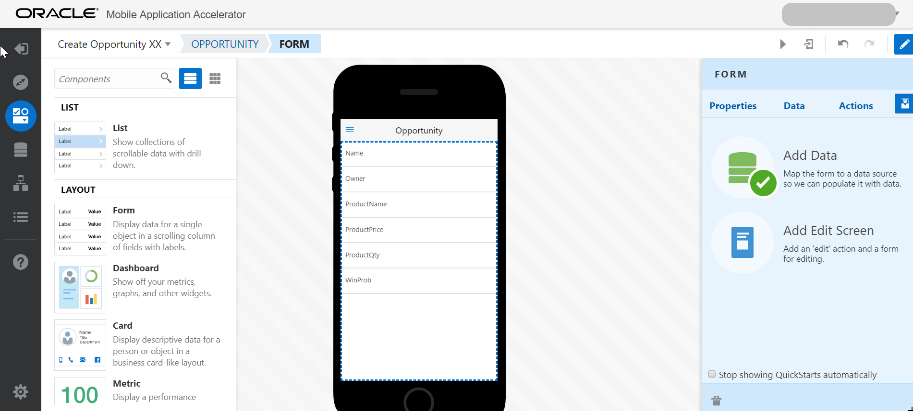

**3.7** Crear el botón de guardar la oportunidad. Para eso clic en el ícono **Application Screens** (1), en **Opportuninity** -> **Edit** (2) -> **Header Buttons** (3).

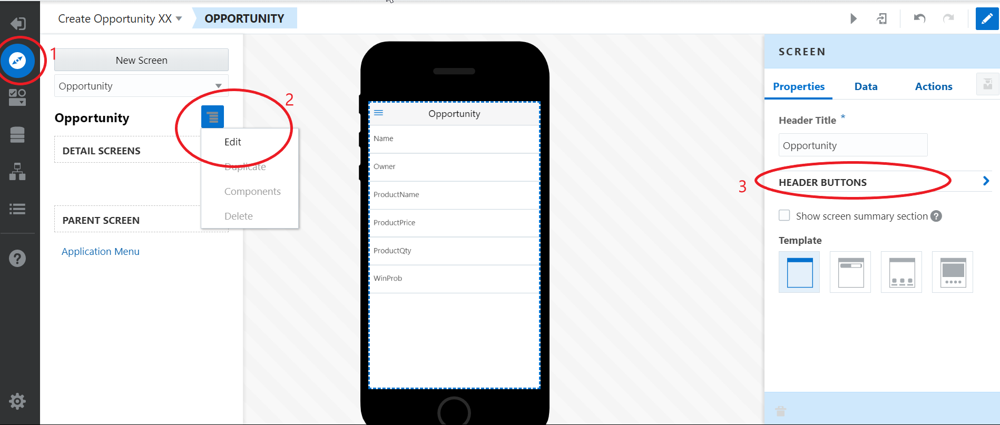

En **Right Side** -> **Button +** -> **Button Label** escribelo `Save`


Escribelo `Save`

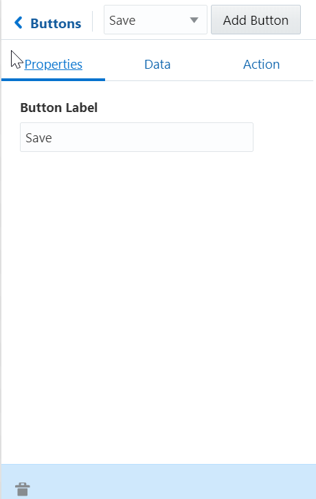

**3.8** En la aba **Action** clic en **ADD ACTION (TAP BUTTON)**, clic en **Tap** nuevamente

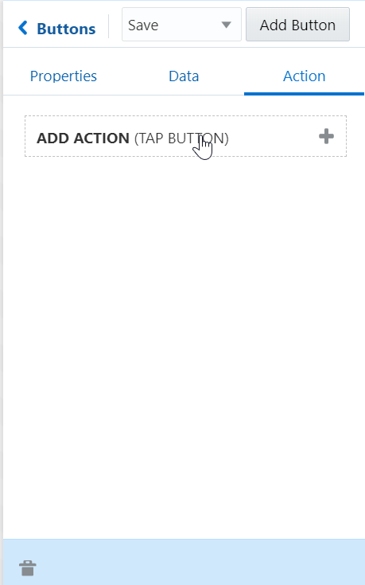

**3.9** En **Configure Action** arraste la acción que se encuentra en **Business Objects** -> **Create Opportunity** para a derecha

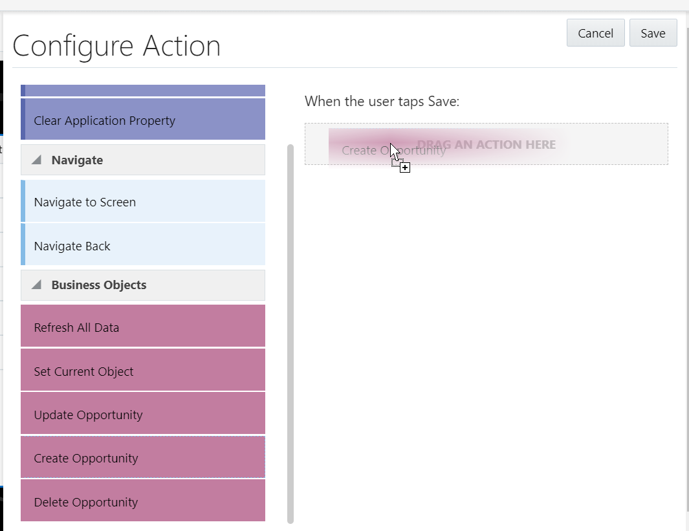

Después arraste las opciones **Refresh All Data** y **Navigate to Screen**. Clic en **Business Action Mapper**


**3.10** Hacer el mapeo de los campos que son en **Current Screen** para **Action Parameters** de acuerdo con la pantalla abajo, y después clic en **Finish**:

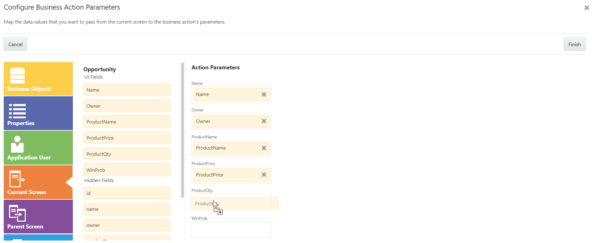

Clic en **Save** de acuerdo con la imagen:

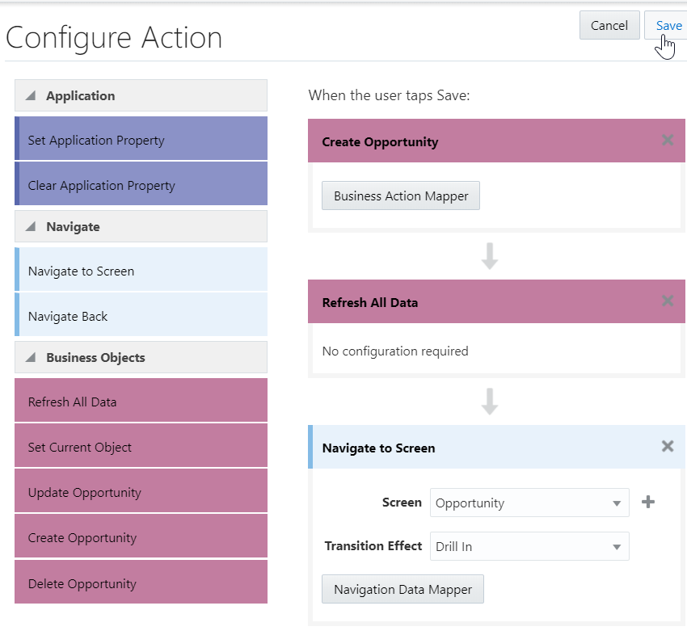

**3.11** Vamos crear una la nueva pantalla, esta pantalla será llamada após la criacción de la oportunidad, para indicar que la oportunidad fue criada con suceso. Clic en el ícono **Application Screens** -> **New Screen**

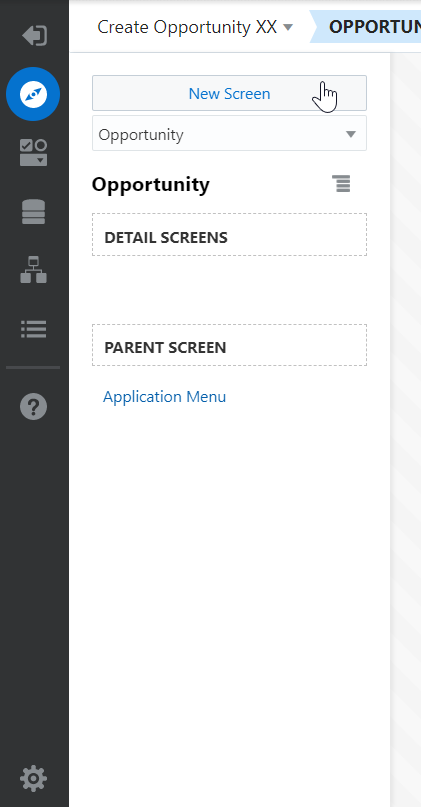

En la pantalla de criacción, siga las instrucciones de acuerdo con las pantallas abajo, hasta el final.


- **Screen Title** : `Success`

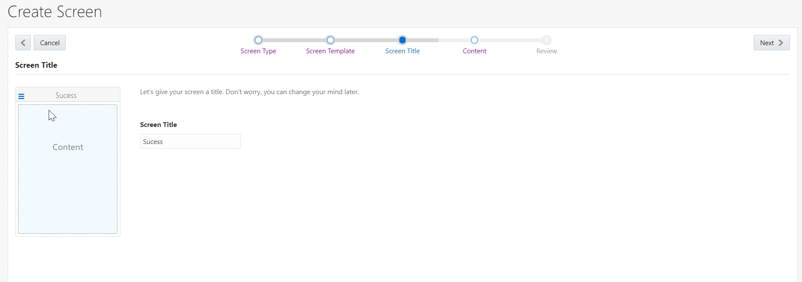

Clic en **Finish**


**3.12** Nesta nueva pantalla colocar una imagen de suceso. Esta pantalla será llamada apóis a criacción de la oportunidad. Para eso arraste el componente **Image** para la pantalla de *design*. 

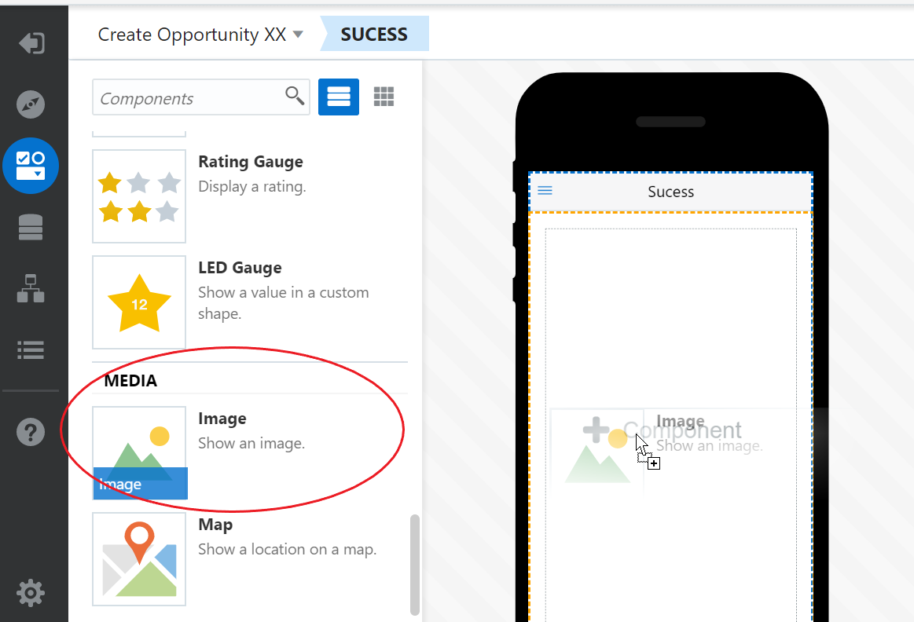

Clic En la aba **Data** y después en **Upload a custom image** y selecione la imagen [like-red.png](https://github.com/matheus-neia/Oracle/blob/master/paas4saas/files/like-red.png) que está ln la carpeta files. 

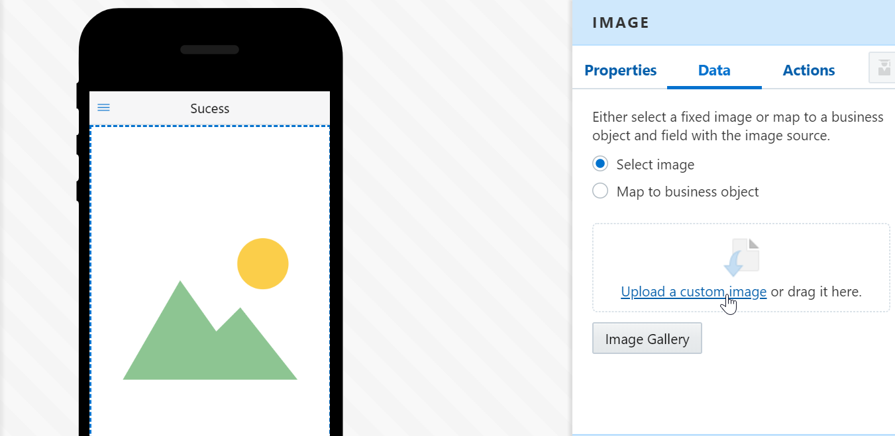

**3.13** Clic en el ícono **Application Screens** y selecione la pantalla **Opportunity** (Este nombre puede variar dependendo de lo nombre de la pantalla que usted colocou en el passo 3.2). 
Después seleccionar a pantalla, Clic En la aba **Actions** -> **Create Opportunity**.


**3.14** Altere a acción **Navigate to Screen** y escolhe a pantalla llamada `Success` (Este nombre puede variar dependendo de lo nombre de la pantalla que pones en passo 3.11). Clic en **Save**.

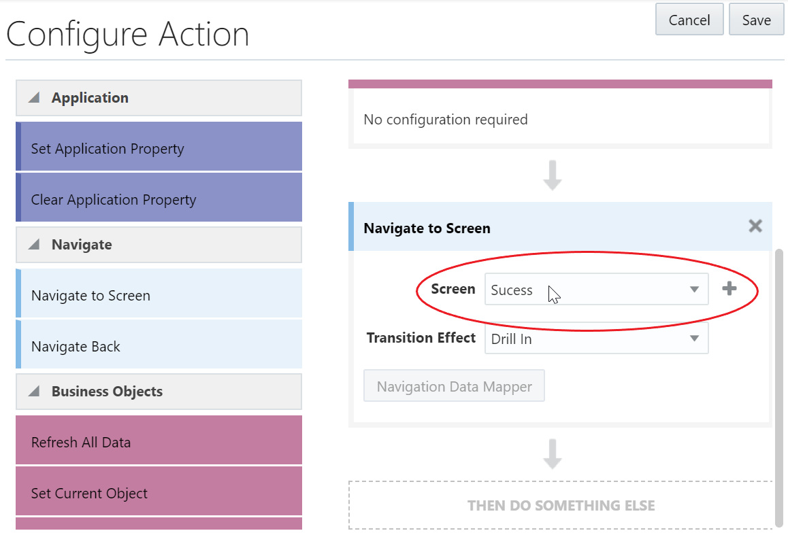

###Paso 4

**4.1** Clic en el ícono de prueba de acuerdo imagen abajo.


**4.2** Ingrese sus datos de login para simular el prueba. Después rellene los campos de acuerdo la figura abajo y después clic en **Save**


Debe ser presentado la pantalla `Success`.


**4.3** Ahora usted puede realizar la prueba en tu próprio celular, descaargando el aplicativo Oracle MAX en tu celular a través de los links abajo, después clic en el ícono **Publish** y siga as instrucciones:

Google Play:

https://play.google.com/store/apps/details?id=com.oracle.max&hl=en

Apple Store:

https://itunes.apple.com/us/app/oracle-max/id1091771940?mt=8

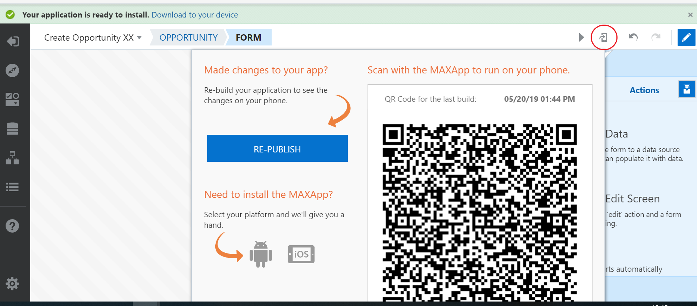