# Lab 3 - Desenvolvimento de uma tela Mobile utilizando Oracle Mobile Cloud Service - MCS

## Objetivos
- Passo 1: Criar um conector conector com o Process Cloud
- Passo 2: Desenvolver uma API Rest utilizando Javascript, para chamar o conector
- Passo 3: Criar uma aplicação Mobile - Oracle MAX
- Passo 4: Efetuar deploy e teste do App

## Pré-Requisitos
Leia os Links abaixo:
- Executar o Lab 1 e Lab 2
- Ter acesso ao OIC Enterprise Edition
- Ter acesso ao Oracle Mobile Hub
- Instalar o app Oracle MAX no seu celular - [Installing the MAX App](https://docs.oracle.com/en/cloud/paas/mobile-hub/build-low-code/building-and-testing-your-apps.html#GUID-60364DA2-2464-4C4F-ADB3-C845E1B6E591)
- Ver o Vídeo [An Introduction to Mobile Application Accelerator (MAX)](https://docs.oracle.com/en/cloud/paas/mobile-hub/build-low-code/what-is-mobile-application-accelerator.html#GUID-CD0DA584-C21A-4FB3-A284-4EF75819B138)

### Passo 1
**1.1** Faça o login da sua conta no Oracle Ingration Cloud, conta utilizada no Lab 1 e Lab 2.


**1.2** Vá na opção **Processes** -> **Process Applications** -> **Activate**


**1.3** Sua aplicação criada no lab 2 deverá estar lá. Vá na opção **Actions** (1) -> **Web Services** (2)


**1.4** Copie a URL da aba **Exposed** Guarde esta url em um bloco de notas. No meu exemplo ficou algo assim `https://xxxxxxx.oraclecloud.com/soa-infra/services/oracleinternalpcs/CreateOpp_XX!1.0.0*xxxxxxxx/ProcessCreateOppOnSalesCloud.service?WSDL`


**1.5** Faça o login da sua conta no **Oracle Mobile Cloud Hub**. Link será entregue pelo instrutor.


**1.6** No menu a esquerda vá na opção **Development** -> **Connectors** 

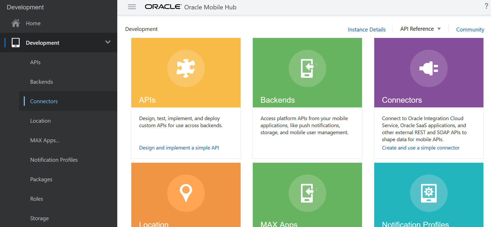

**1.7** Clique em **+ New Connector** -> **SOAP**


**1.8** Preencha os campos:
- **API Display Name** como `CreateOPPConectorPCS_XX` onde XX é o número entregue pelo instrutor.
- **WSDL URL** com a url que você guardou no passo 1.4. 
- **Short Description** com uma descriçao escolhida por você. 

Agora clique em **Create**. 

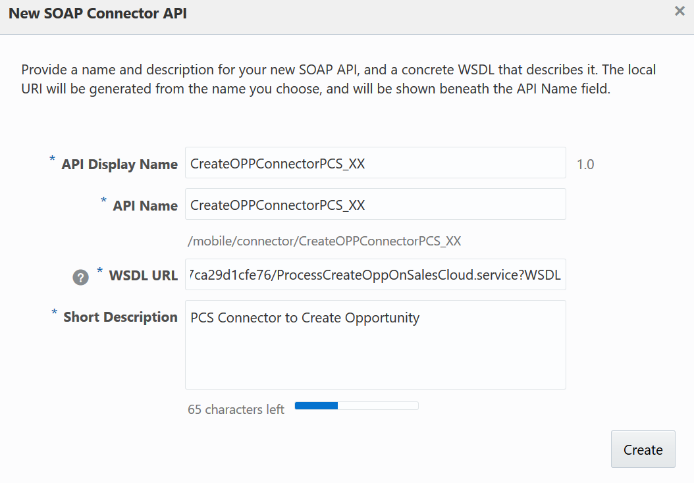

Na próxima tela confirme suas informações e clique em **>**.


**1.9** Escolha a política de segurança com nome `oracle/http_basic_auth_over_ssl_client_policy` e depois adicione uma **csf-key**, para isso clique no ícone chave, abaixo a direita da tela.


**1.10** Na tela **Select or Create a New API Key** clique em **Add** e depois preencha os campos:
- **Key Name** com `PCS_TTC_XX` onde XX é o número entregue pelo instrutor.
- **Short Description** com `PCS_TTC_XX` onde XX é o número entregue pelo instrutor.
- **User Name** com o usuário que você utiliza para conectar no Oracle Cloud.
- **Password** com a senha que você utiliza para conectar no Oracle Cloud.

Clique em **Save** e depois **Select**, vá para a próxima tela, tela de teste, clicando em **>**.


**1.11** Preencha o campo **HTTP Message Body** com o seguinte código:

```json
{
   "Header": null,
   "Body": {
      "start": {
         "formArg": {
            "Opportunity": {
               "opportunityName": "opportunityName45",
               "owner": "owner46",
               "winProb": "10",
               "productName": "productName48",
               "productPrice": 0,
               "productQty": 0
            }
         }
      }
   }
}
```

Nos campos de autenticação escolha em **Backend** a opção de `bots_samples` e preencha com seu username e password que você utilizou para conectar no Oracle Cloud.

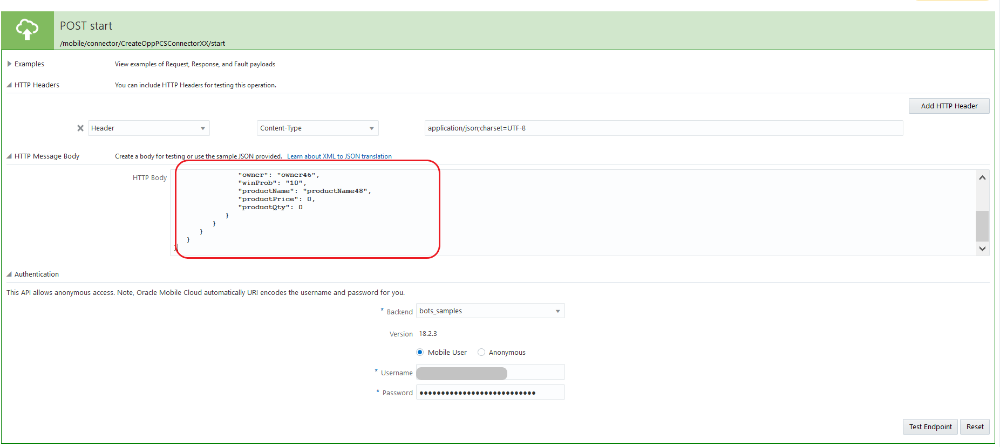

**1.12** Clique em **Test Endpoint** e espere a resposta da chamada até o Process Cloud, ela deverá retornar um status 200, algo parecido com a imagem abaixo. Se der algum erro, tente corrigir o nome das variáveis que você colocou no passo 1.11, ou verique seu login e senha estão corretos. Caso contrário clique em **Done**.

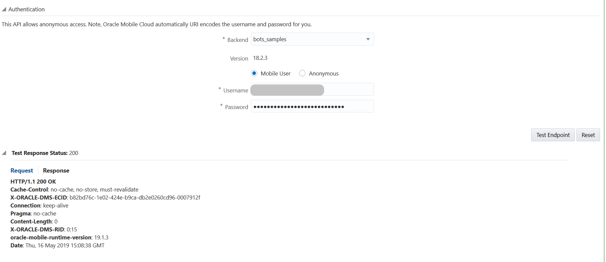

### Passo 2

**2.1** Na tela inicial do Oracle Mobile Hub vá em **Development** -> **APIs** -> **+ New Api** -> **Express API**.


**2.2** Vá até **Resources** -> **+ New Resource**.


**2.3** Preencha os campos:
- **Display Name**: `Opportunity`
- **Name** : `opportunity`
- **Display Name (plural)** : `Opportunities`

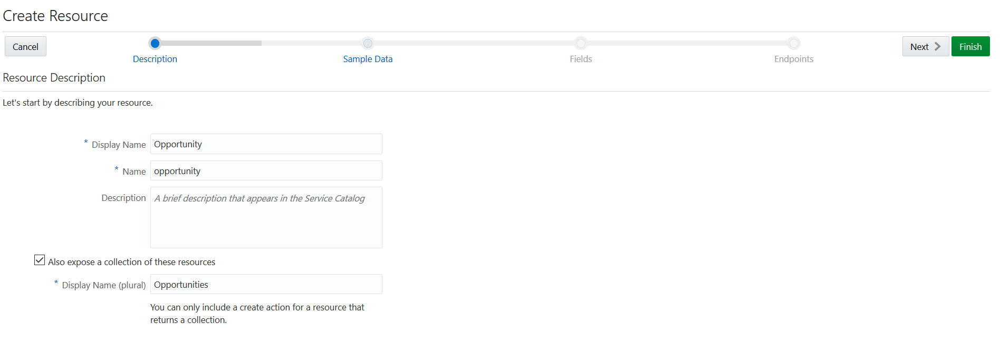

Clique em **Next >**

**2.4** Clique em **Add Sample Data**.


Preencha o campo com o json abaixo e vá para a próxima página.
```json
{
	"name": "opportunityName45",
	"owner": "owner46",
	"winProb": "10",
	"productName": "productName48",
	"productPrice": 0,
	"productQty": 0
}
```


**2.5** Clique em **Finish**

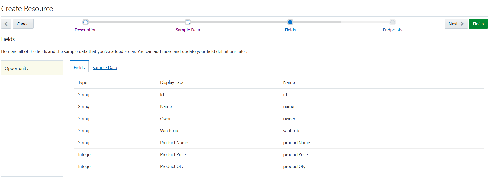

Clique em **Save**

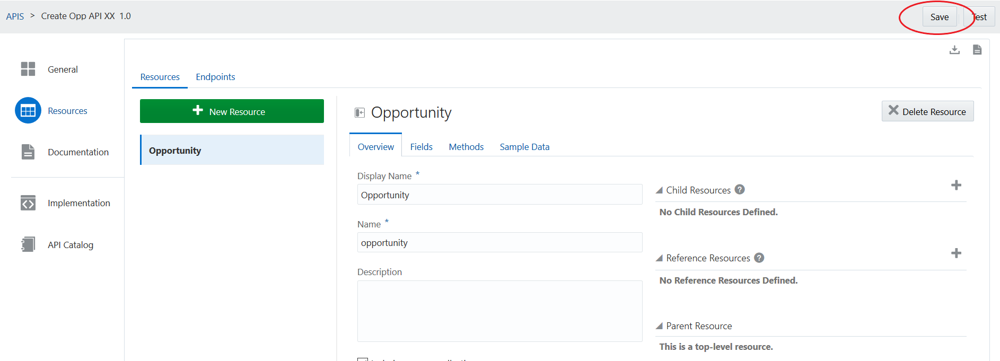

**2.6** Clique em **Implementation** e faça o download do arquivo de exemplo clicando no botão **JavaScript Scaffold**.


O arquivo baixado terá o nome parecido com `createoppapixx.zip`. Descompacte o arquivo em seu computador, ele deverá conter os seguintes arquivos:

| Files  |
| ------------ |
|createoppapixx.js   |
|createoppapixx.raml   |
|package.json   |
|ReadMe.md   |
|samples.txt   |
|swagger.json   |
|toolsConfig.json  |


**2.7** Vamos escrever a chamada da API em Javascript.

**2.7.1** Edite o arquivo `package.json` e adicione na linha 9 o conector que criamos no passo 1. Ele deverá ficar parecido com o código abaixo:

```json
{
  "name" : "createoppapixx",
  "version" : "1.0.0",
  "description" : "Create Opp API XX",
  "main" : "createoppapixx.js",
  "oracleMobile" : {
    "dependencies" : {
      "apis" : { },
      "connectors" : { "/mobile/connector/CreateOPPConectorPCS_XX" : "1.0" }
    }
  }
}
```
Lembre-se que **CreateOPPConectorPCS_XX** deverá ser substituido pelo nome do conector que você criou no passo 1.8 no campo **API Name**

**2.7.2** Edite o arquivo `createoppapixx.js`. Vamos alterar o método chamado `service.post('/mobile/custom/CreateOppAPIXX/opportunity', function(req,res) {});` conforme a imagem abaixo.


Este método deverá conter o seguinte código:

```javascript
service.post('/mobile/custom/CreateOppAPIXX/opportunity', function(req,res) {
	var sdk = req.oracleMobile;
	var optionsList = {
			Header: null,
			Body: {
				"start" : {
					"formArg" : {
						"Opportunity": {
							"opportunityName": req.body['name'],
			            	"owner": req.body['owner'],
							"winProb": req.body['winProb'],
							"productName": req.body['productName'],
							"productPrice": req.body['productPrice'],
							"productQty": req.body['productQty']
						}
					}
				}
			}
		};

	sdk.connectors.post('CreateOppPCSConnectorXX', 'start', optionsList, {inType: 'json', versionToInvoke: '1.0'}).then(
		function (result) {
			res.status(result.statusCode).send(result.result);
		},
		function (error) {
			res.status(error.statusCode).send(error.error);
		}
	);
});
```

**2.7.3** Agora salve todos os arquivos e compacte novamente com o nome `createoppapixx.zip`. Com este .zip em mãos faça o upload no Oracle Mobile Hub através do link **Upload an implementation archive** conforme tela abaixo, depois clique em **Test**.


**2.8** Na tela da API clique em **Test**, caso não tenha clicado no passo 2.7.3. Clique em **POST Create Opportunity** e depois em **Use Example**. Preencha o **Backend** como bots_samples e **Authentication Method** como Current User.


Agora clique em **Test Endpoint**
	
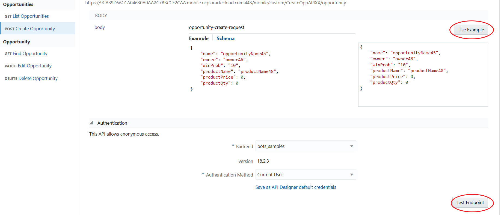

O resultado deverá ser o status 200, algo parecido com a imagem abaixo:


**2.9** Agora vamos publicar o conector e a API desenvolvida, dessa forma o Oracle MAX irá conseguir enchergar a API. 

Publique o conector conforme imagem abaixo:

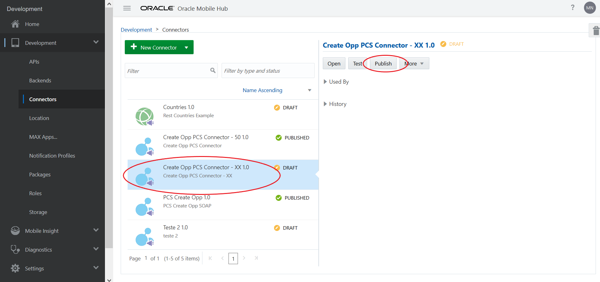

Publique a API conforme imagem abaixo:

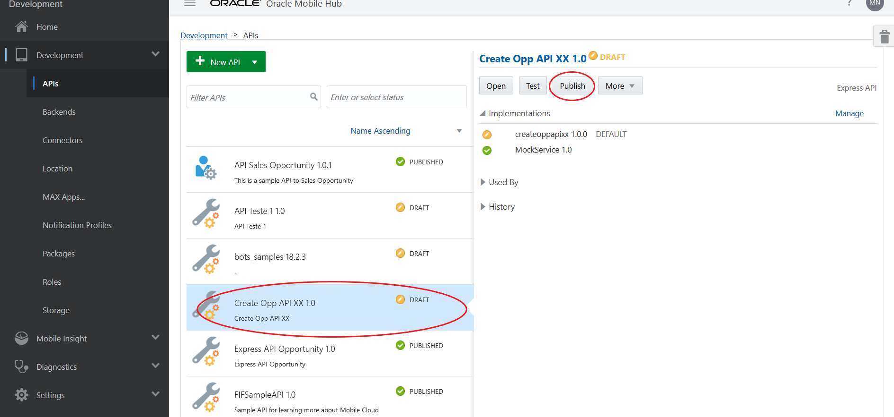

### Passo 3

**3.1** Na tela inicial do Oracle Mobile Hub vá em **Development** -> **MAX Apps** -> **New Application**.

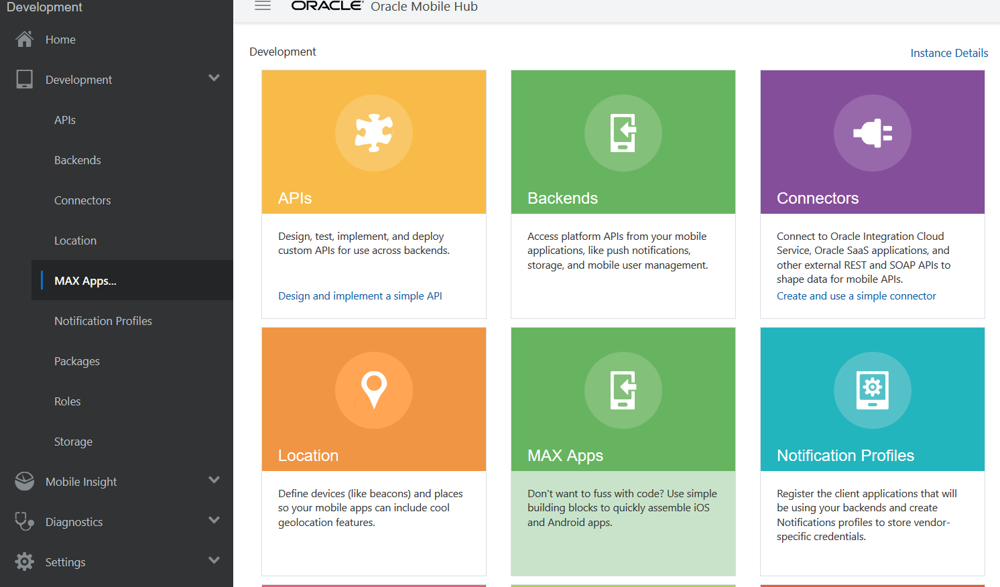

**New Application**


**3.2** Na tela de criação, siga as instruções conforme as telas abaixo, até chegar na opção de criar a aplicação.

- **Application Name** : `Create Opportunity XX`


- **Screen Title** : `Opportunity`


Clique em **Create**


**3.3** Na tela inicial da aplicação, clique no ícone **Data** (1) -> **Applications Services +** (2). Na tela que abrirá escolha a API criada no passo 2.9, no meu caso é a `Create Opp API XX` (3) e por fim clique em **Select** (4).

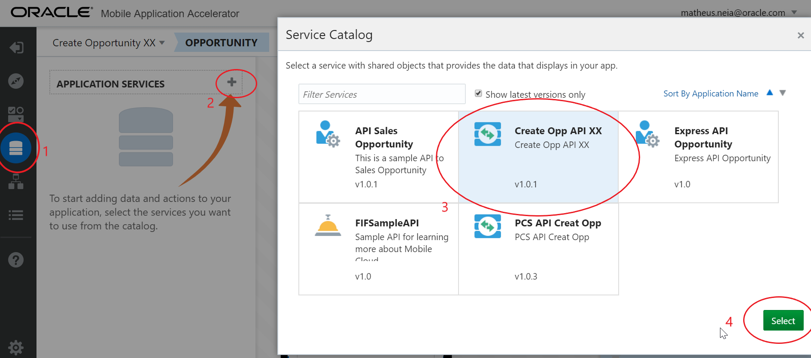

**3.4** Clique no ícone **Components**, arraste o component **Form** para tela do celular.

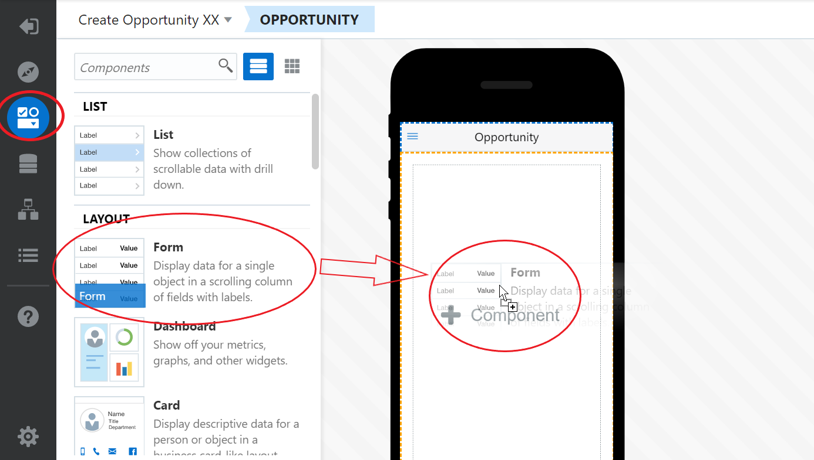

**3.5** Do lado direito da tela clique em **Add Data** e depois selecione **Opportunity**

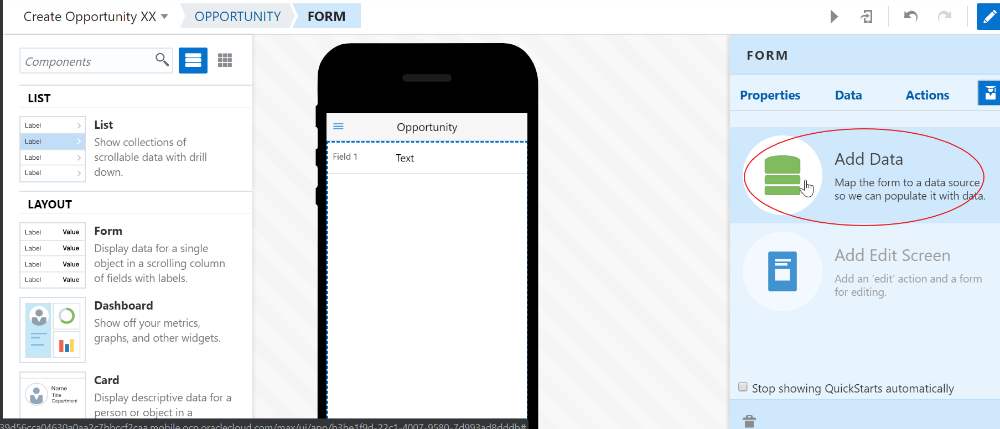

Selecione **Opportunity**


**3.6** Faça o mapeamento de todos os campos do **Business Object** em **Form Component Fields**, arrastando o que está no campo **Opportunity** para **Form Component Fields**, retire apenas o **id**, por fim clique em **Finish**. 


Como ficará a tela após clicar em Finish:


**3.7** Vamos criar o botão de salvar a oportunidade. Para isso clique no ícone **Application Screens** (1), em **Opportuninity** -> **Edit** (2) -> **Header Buttons** (3).


Em **Right Side** -> **Button +** -> **Button Label** digite `Save`

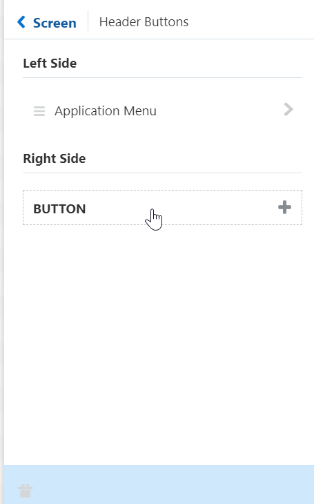

Digite `Save`


**3.8** Na aba **Action** clique em **ADD ACTION (TAP BUTTON)**, clique em **Tap** novamente


**3.9** Em Configure Action arraste a ação que está localizada em **Business Objects** -> **Create Opportunity** para a direita


Depois arraste as opções **Refresh All Data** e **Navigate to Screen**. Clique em **Business Action Mapper**


**3.10** Faça o mapeamento dos campos que estão em **Current Screen** para **Action Parameters** conforme tela abaixo, e depois clique em **Finish**:


Clique em **Save** conforme imagem:


**3.11** Vamos criar uma nova tela, esta tela será chamada após a criação da oportuniade, para indicar que a oportunidade foi criada com sucesso. Clique no ícone **Application Screens** -> **New Screen**


Na tela de criação, siga as instruções conforme as telas abaixo, até chegar ao final.

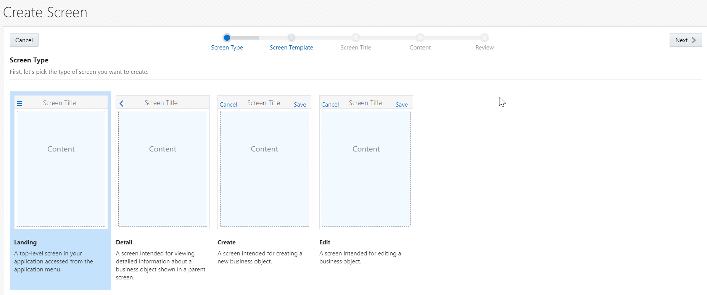

- **Screen Title** : `Success`


Clique em **Finish**


**3.12** Nesta nova tela vamos colocar uma imagem de sucesso. Esta tela será chamada apóis a criação da oportuniadde. Para isso arraste o componente **Image** para a tela de *design*. 


Clique na aba **Data** e depois em **Upload a custom image** e selecione a imagem [like-red.png](https://github.com/matheus-neia/Oracle/blob/master/paas4saas/files/like-red.png) que está na pasta files. 


**3.13** Clique no ícone **Application Screens** e selecione a tela **Opportunity** (Este nome pode variar dependendo do nome da tela que você colocou no passo 3.2). 
Após selecionar a tela, clique na aba **Actions** -> **Create Opportunity**.

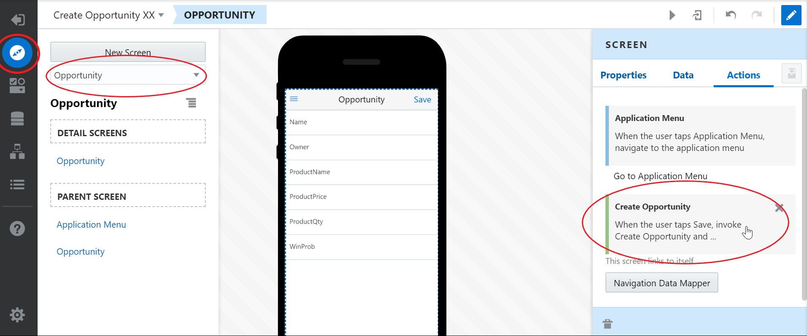

**3.14** Altere a ação **Navigate to Screen** e escolhe a tela chamada `Success` (Este nome pode variar dependendo do nome da tela que você colocou no passo 3.11). Depois clique em **Save**.


###Passo 4

**4.1** Clique no ícone de teste conforme imagem abaixo.


**4.2** Insira seus dados de login para simular o teste. Após isso preencha os campos conforme figura abaixo e depois clique em **Save**

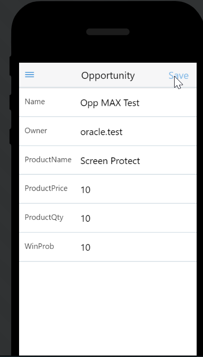

Deverá ser apresentada a tela de `Success`.

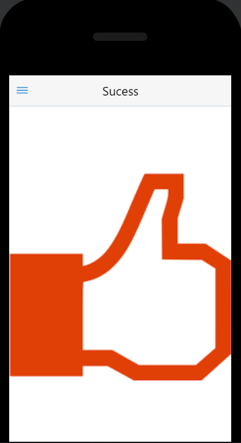

**4.3** Agora você pode realizar o teste em seu próprio celular, baixando o aplicativo Oracle MAX em seu celular através dos links abaixo, depois clique no ícone **Publish** e siga as instruções:

Google Play:

https://play.google.com/store/apps/details?id=com.oracle.max&hl=en

Apple Store:

https://itunes.apple.com/us/app/oracle-max/id1091771940?mt=8

