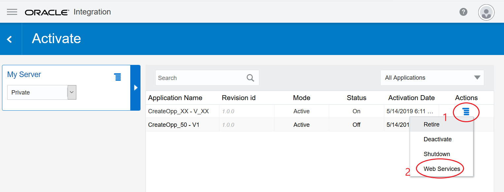
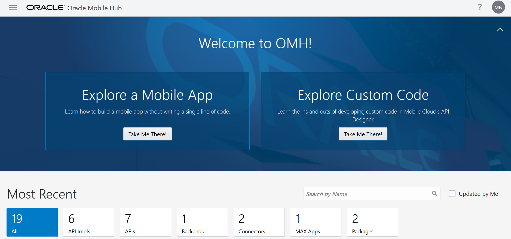
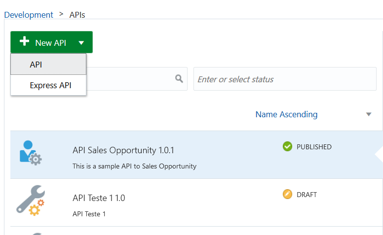
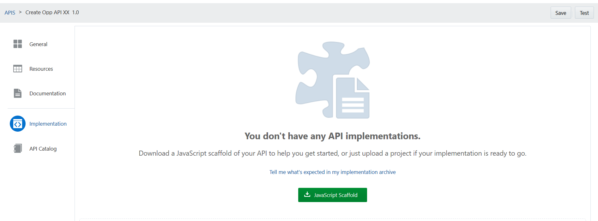
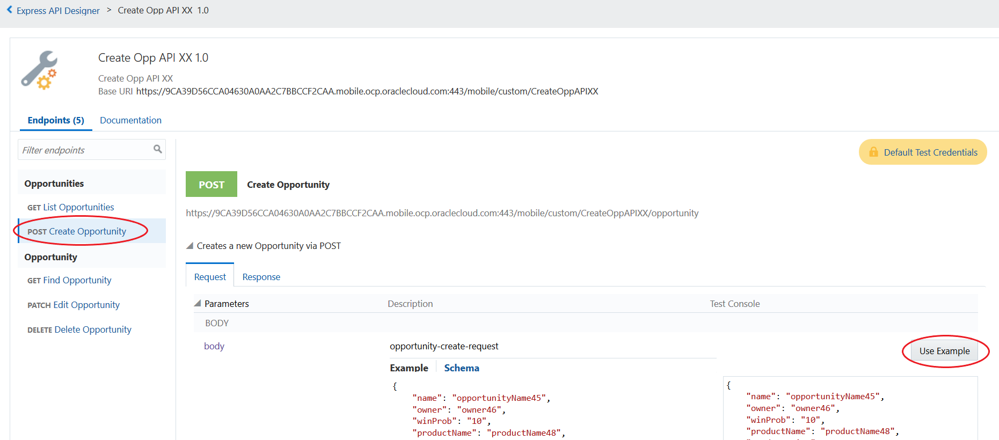
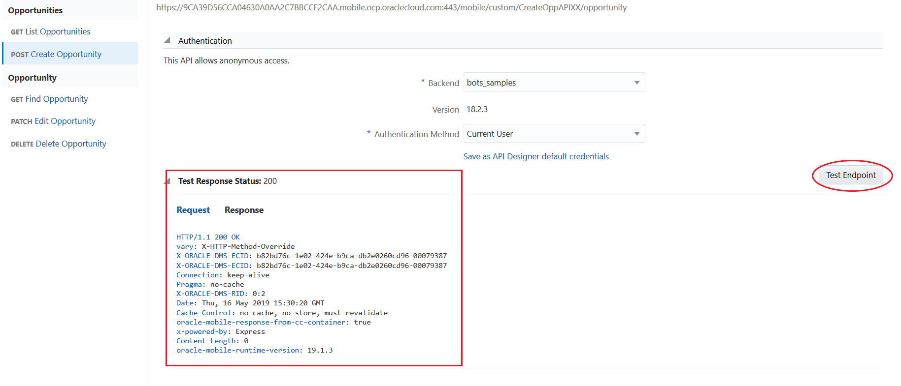

# Lab 2 - Desenvolvimento de uma tela Mobile utilizando Oracle Mobile Cloud Service - MCS

## Objetivos
- Passo 1: Criar um conector conector com o Process Cloud
- Passo 2: Desenvolver uma API Rest utilizando Javascript, para chamar o conector
- Passo 3: Criar uma aplicação Mobile - Oracle MAX
- Passo 4: Efetuar deploy e teste do App

## Pré-Requisitos
Leia os Links abaixo:
- Executar o Lab 1 e Lab 2
- Ter acesso ao OIC Enterprise Edition
- Ter acesso ao Oracle Mobile Hub
- Instalar o app Oracle MAX no seu celular

### Passo 1
**1.1** Faça o login da sua conta no Oracle Ingration Cloud, utilizado no Lab 1 e Lab 2.


**1.2** Vá na opção **Processes** -> **Process Applications** -> **Activate**


**1.3** Sua aplicação criada no lab 2 deverá estar lá. Vá na opção **Actions** (1) -> **Web Services** (2)



**1.4** Copie a URL da aba **Exposed**, guarde esta url em um bloco de notas. No meu exemplo ficou algo assim `https://xxxxxxx.oraclecloud.com/soa-infra/services/oracleinternalpcs/CreateOpp_XX!1.0.0*xxxxxxxx/ProcessCreateOppOnSalesCloud.service?WSDL`


**1.5** Faça o login da sua conta no **Oracle Mobile Cloud Hub**. Link será entregue pelo instrutor.



**1.6** No menu a esquerda vá na opção **Development** -> **Connectors** 


**1.7** Clique em **+ New Connector** -> **SOAP**


**1.8** Preenche os campos:
- **API Display Name** como `CreateOPPConectorPCS_XX` onde XX é o número entregue pelo instrutor.
- **WSDL URL** com a url que você guardou no passo 1.4. 
- **Short Description** com uma descriçao escolhida por você. 
Agora clique em **Create**. 


Na próxima tela confirme suas informações e clique em **>**.


**1.9** Escolha a política de segurança com nome `oracle/http_basic_auth_over_ssl_client_policy` e depois adicione uma **csf-key**, para isso clique no ícone chave, abaixo a direita da tela.


**1.10** Clique em **Add** e depois preencha os campos:
- **Key Name** com `PCS_TTC_XX` onde XX é o número entregue pelo instrutor.
- **Short Description** com `PCS_TTC_XX` onde XX é o número entregue pelo instrutor.
- **User Name** com o usuário que você utiliza para conectar no Oracle Cloud
- **Password** com a senha que você utiliza para conectar no Oracle Cloud
Clique em **Save** e depois **Select**, vá para a próxima tela, tela de teste, clicando em **>**.


**1.11** Preencha o campo **HTTP Message Body** com o seguinte código:

```json
{
   "Header": null,
   "Body": {
      "start": {
         "formArg": {
            "Opportunity": {
               "opportunityName": "opportunityName45",
               "owner": "owner46",
               "winProb": "10",
               "productName": "productName48",
               "productPrice": 0,
               "productQty": 0
            }
         }
      }
   }
}
```

`
{
   "Header": null,
   "Body": {
      "start": {
         "formArg": {
            "Opportunity": {
               "opportunityName": "opportunityName45",
               "owner": "owner46",
               "winProb": "10",
               "productName": "productName48",
               "productPrice": 0,
               "productQty": 0
            }
         }
      }
   }
}
`

Nos campos de autenticação escolha em **Backend** a opção de `bots_samples` e preencha com seu username e password que você utiliza para conectar no Oracle Cloud.


**1.12** Clique em **Test Endpoint** e espere a resposta da chamada até o Process Cloud, ela deverá retornar um status 200, algo parecido com a imagem abaixo. Se der algum erro, tente corrigir o nome das variáveis que você colocou no passo 1.11, ou verique seu login e senha estão corretos. Caso contrário clique em **Done**.


### Passo 2

**2.1** Na tela inicial do Oracle Mobile Hub vá em **APIs** -> **+ New Api** -> **Express API**.




**2.2** Vá até **Resources** -> **+ New Resource**.


**2.3** Preencha os campos:
- **Display Name**: `Opportunity`
- **Name** : `opportunity`
- **Display Name (plural)** : `Opportunities`


Clique em **Next >**

**2.4** Clique em **Add Sample Data**.


Preencha o campo com o json abaixo e vá para a próxima página.
```json
{
	"name": "opportunityName45",
	"owner": "owner46",
	"winProb": "10",
	"productName": "productName48",
	"productPrice": 0,
	"productQty": 0
}
```


**2.5** Clique em **Finish**


Clique em **Save**


**2.6** Clique em **Implementation** e faça o download do arquivo de exemplo clicando no ícone **JavaScript Scaffold**.



O arquivo baixado terá o nome parecido com `createoppapixx.zip`. Descompacte o arquivo em seu computador, ele deverá conter os seguintes arquivos:

| Files  |
| ------------ |
|createoppapixx.js   |
|createoppapixx.raml   |
|package.json   |
|ReadMe.md   |
|samples.txt   |
|swagger.json   |
|toolsConfig.json  |


**2.7** Vamos escrever a chamada da API em Javascript.
**2.7.1** Edite o arquivo `package.json` e adicione na linha 9 o conector que criamos no passo 1. Ele deverá ficar parecido com o código abaixo:

```json
{
  "name" : "createoppapixx",
  "version" : "1.0.0",
  "description" : "Create Opp API XX",
  "main" : "createoppapixx.js",
  "oracleMobile" : {
    "dependencies" : {
      "apis" : { },
      "connectors" : { "/mobile/connector/CreateOPPConectorPCS_XX" : "1.0" }
    }
  }
}
```
Lembre-se que **CreateOPPConectorPCS_XX** deverá ser substituido pelo nome do conector que você criou no passo 1.8 no campo **API Name**

**2.7.2** Edite o arquivo `createoppapixx.js`. Vamos alterar o método chamado `service.post('/mobile/custom/CreateOppAPIXX/opportunity', function(req,res) {});` conforme a imagem abaixo.


Este método deverá conter o seguinte código:

```javascript
var sdk = req.oracleMobile;
var optionsList = {
		Header: null,
		Body: {
				"start" : {
				"formArg" : {
				"Opportunity": {
				"opportunityName": req.body['Name'],
						"owner": req.body['Owner'],
						"winProb": req.body['Win Prob'],
						"productName": req.body['Product Name'],
						"productPrice": req.body['Product Price'],
						"productQty": req.body['Product Qty']
					}
				}
			}
		}
	};

sdk.connectors.post('Teste2', 'start', optionsList, {inType: 'json', versionToInvoke: '1.0'}).then(
	function (result) {
		res.status(result.statusCode).send(result.result);
	},
	function (error) {
		res.status(error.statusCode).send(error.error);
	}
);
```

**2.7.3** Agora salve todos os arquivos e compacte novamente com o nome `createoppapixx.zip`. Com este .zip em mãos faça o upload no Oracle Mobile Hub através do link **Upload an implementation archive** conforme tela abaixo, depois clique em **Test**.


**2.8** Na tela da API clique em **Test**, caso não tenha clicado no passo 2.7.3. Clique em **POST Create Opportunity** e depois em **Use Example**. Preencha o **Backend** como bots_samples e **Authentication Method** como Current User.



Agora clique em **Test Endpoint**


O resultado deverá ser com o Status 200, algo parecido com a imagem abaixo:

