# Lab 4 - Desarrollo de una la pantalla utilizando Oracle Visual Builder

## Objetivos
- Paso 1: Crear aplicación VBCS con el formulario para cadastro de la oportunidad
- Paso 2: Configurar una la llamada de lo VBCS para el Oracle Process Cloud
- Paso 3: Crear una llamada de lo formulario VBCS para el Oracle Process Cloud
- Paso 4: Hacer el prueba y deploy de la aplicación VBCS

## Pré-Requisitos
- Ejecutar el Lab 1 y Lab 2
- Tener acceso ao OIC Enterprise Edition

### Paso 1
**1.1** Ingrese a su cuenta Oracle Ingration Cloud y clic en la opción **Visual Builder**.

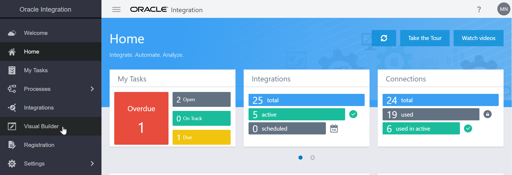

**1.2** Clic en **New** para crear una nueva aplicación.

**1.3** Rellene el o campo **Application Name** con `Workshop VBCS Application XX` (Donde XX será entregado por el instructor).

**1.4** Clic en **Web Apps**:

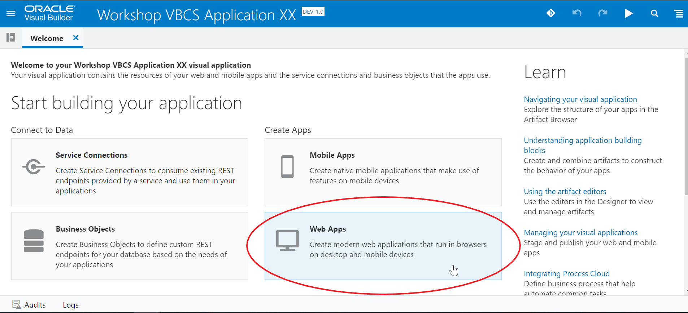

y después clic en **+ Web Application**, nómbralo `Opportunity`

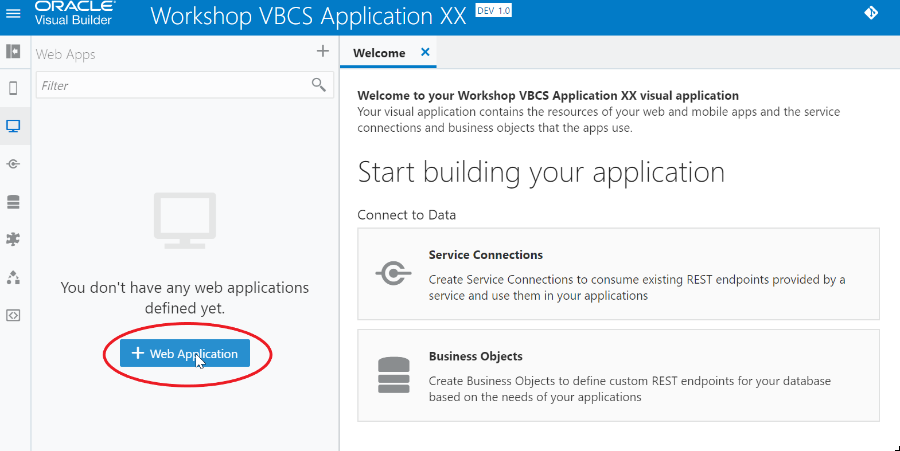

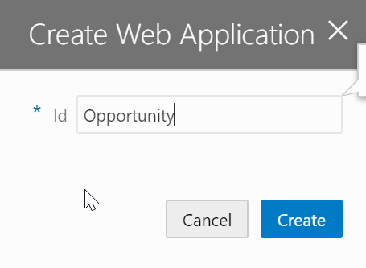

**1.5** Después de la aplicación creada, cambia tu pantalla para una la mejor visualizacción. En el campo **Components** seleccione **Layout -> Form Layout** y arraste para el espacio de diseño. 

**1.6** Vamos a crear los campos de una oportunidad. Arraste el componente **Field -> Input Text** para dentro de **Form Layout**.

Después agregar el componente de lo lado derecho de la pantalla ir hasta aba **General** y rellene el campo **Label Hint** con `Name`.

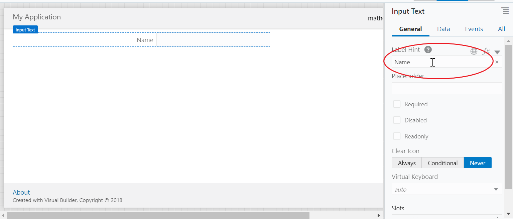

Repita este procedimiento para crear mais 5 campos.

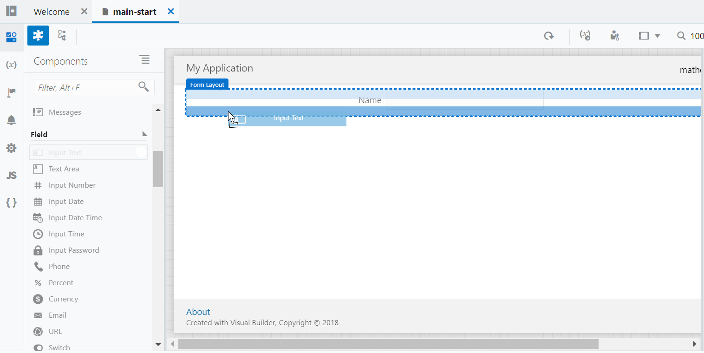

**1.7** Para la criacción dos 5 campos, deben ser dentro de lo **Form Layout**, para eso repita el passo 1.6 con los valores de la tabla abajo.

| Componente Field  | Label Hint  |
| ------------ | ------------ |
| Input Text  | Owner |
| Input Text | Product Name  |
| Currency |  Product Price |
| Input Number  |  Product Quantity |
| Percent  |  Win Probability |

Finalmente agregue un botón en el final de lo formulario, arrastrando el componente **Common -> Button**

**1.8** Seleccione el **Form Layout** En la aba **General** selecione en el campo **Label Edge** a opción **top**

**1.9** Ahora vamos a crear las variables para ser utilizado los campos que em creamos. Para eso siga los passos abajo: 
- Clic en **Variables** (1)
- Clic en **+ Variable** (2)
- Rellene en **ID** : `Opportunity` (3)
- Rellene en **Type** : `Object` (4)
- Clic en **Create** (5)

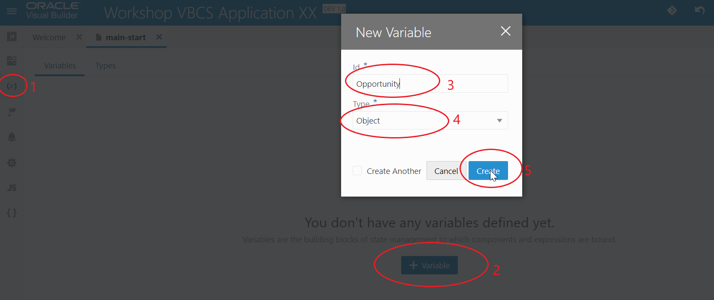

**1.10** Clic en **Add Field** y crie los siguientes campos:

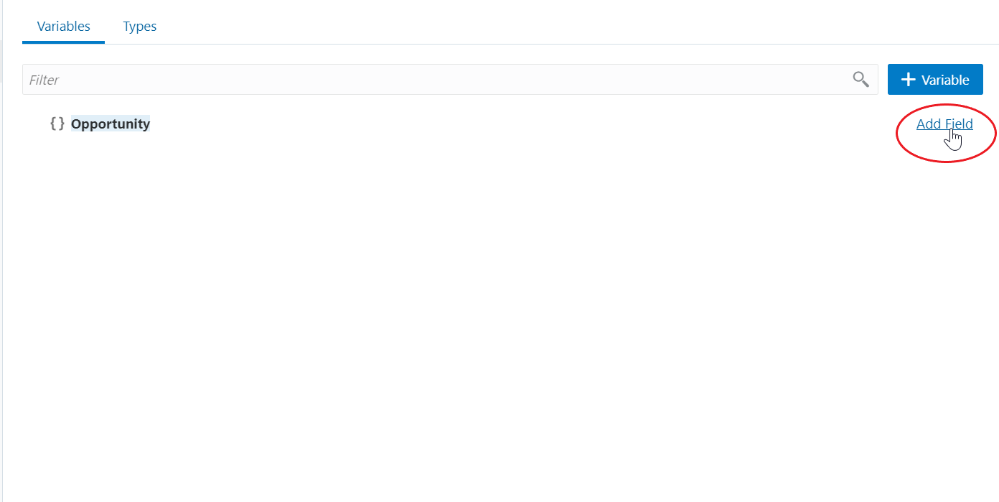

| Id  | Type  |
| ------------ | ------------ |
| Name  | String |
| Owner | String  |
| ProductName |  String |
| ProductPrice  |  Number |
| ProductQty  |  Number |
| WinProb  |  Number |

El resultado final será eso:

**1.11** Ahora vamos a associar las variables que creamos en los campos de la pagina que creamos. Para eso regresse hasta el design de la pantalla y clic en el campo **Name**. En la pestaña **Data** (1) rellene el campo **Value** (2) con la variable **Name** (3)

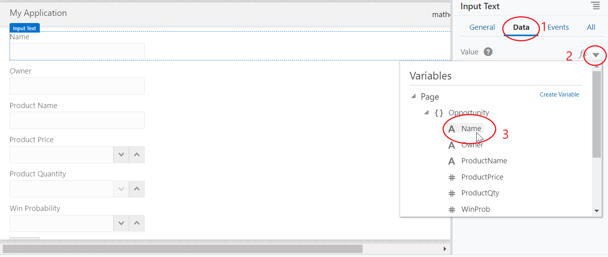

Hacer el mismo para el campo **Owner**

Hacer eso para los demás campos:
- Product Name
- Product Price
- Product Quantity
- Win Probability

### Paso 2

**2.1** Ahora ir en el ícono **Process** para crearmos la integracción entre el Process Cloud y VBCS. 

Clic en Process 

Siga los clics de acuerdo imagen abajo

**2.2** Clic en el **+** para adicionar el processo (1), desactivar la opción de agregar pruebas (2), Rellene el campo **Alias** con `ProcessCreateOpp` (3) y clic en **Add**. (4)

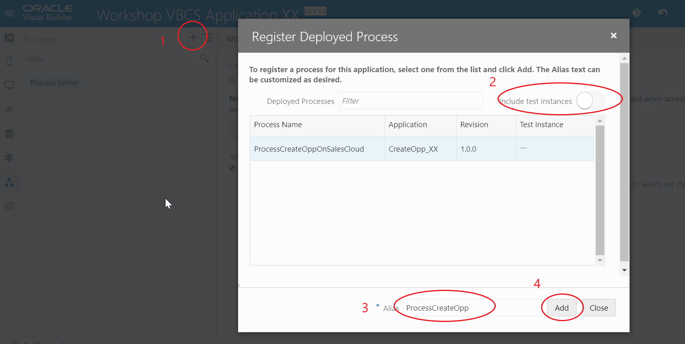

### Paso 3

**3.1** Vamos a crear un evento para el botón **Save**. Para eso siga los clics de acuerdo imagen abajo:

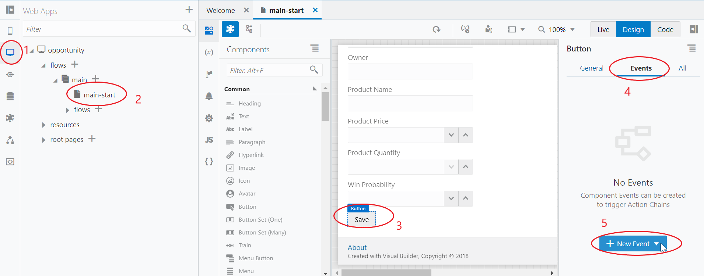

Clic en **Quick Start: 'ojAction'**

**3.2** Arrastra la acción **Start Process** de acuerdo con la imagen abajo:

Clic en **Select Process**

Seleccione el processo con el nombre de lo `alias` que diste en el passo 2.2. En mi caso **ProcessCreateOpp -> Start**

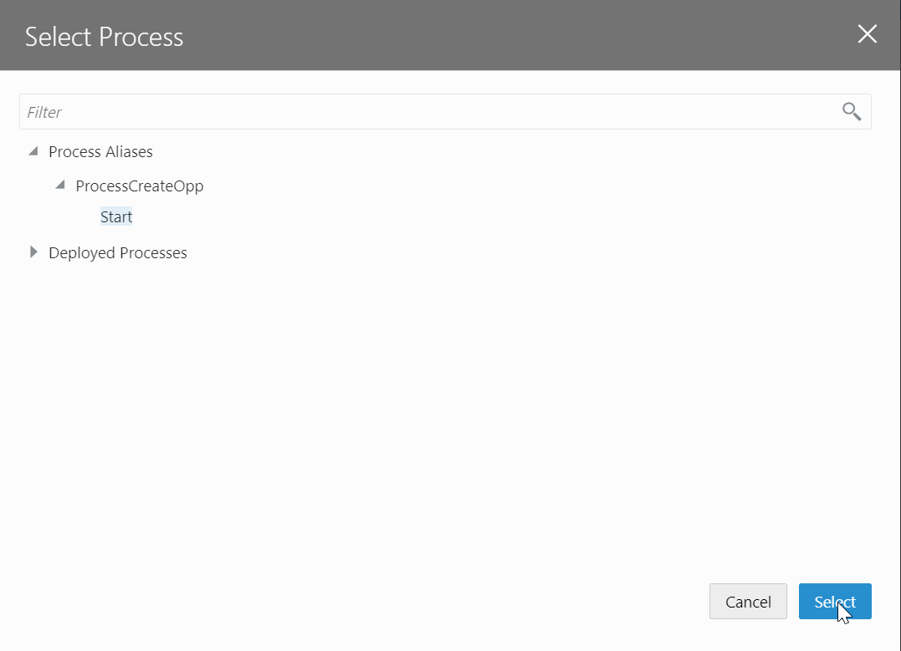

**3.3** Vamos hazer el mapeo de los campos de lo formulario con los campos de la llamada. Para eso clic en **Assign**

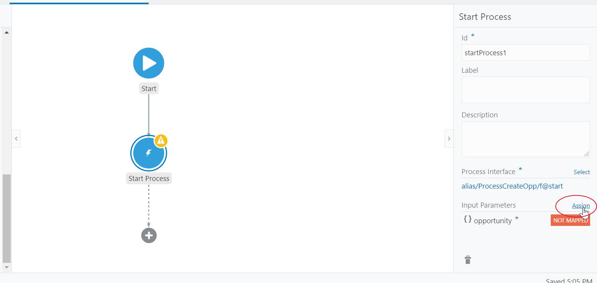

Hacer el mapeo de **Opportuniy -> Name** para **opportuniy -> opportunityName**  de acuerdo imagen abajo:

Ahora hacer los demás mapeos de los campos
- owner
- productName
- productPrice
- productQty
- winProb

**3.4** Crear una más acción llamada **Fire Action** y con las informaciones necesaria, de acuerdo con la imagen abajo:

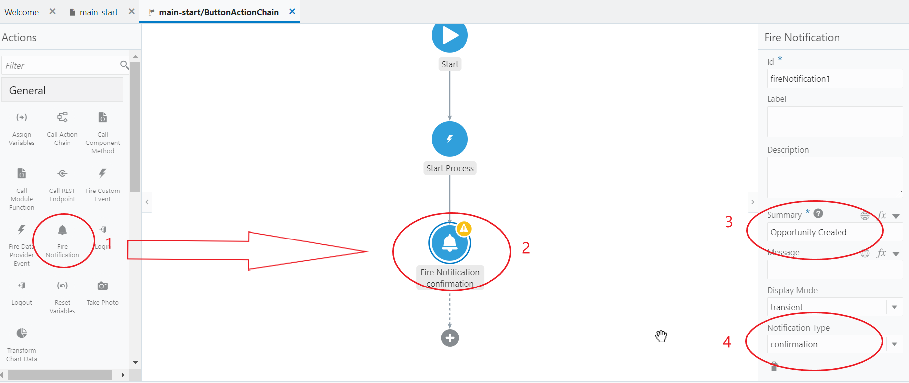

### Paso 4

**4.1** Haga la prueba de la aplicación, clic en el ícono de prueba y después rellenar los datos. De acuerdo con la imagen abajo:

Clic en **Save**

usted deberá recibir un mensagen similiar como este:

**4.2** Vá hasta integration y busca tus requisiciones en **Monitoring** -> **Tracking** (Confome [lab 1, passo 4.7](https://github.com/matheus-neia/Oracle/blob/master/paas4saas/lab1.md#passo-4)) Para verificar si su llamada se realizó con éxito.

**4.3** Ahora regresse hasta la pantalla de Visual Builder y clic en **All Applications** encontre tu aplicación `Workshop VBCS XX` y clic en **Stage**

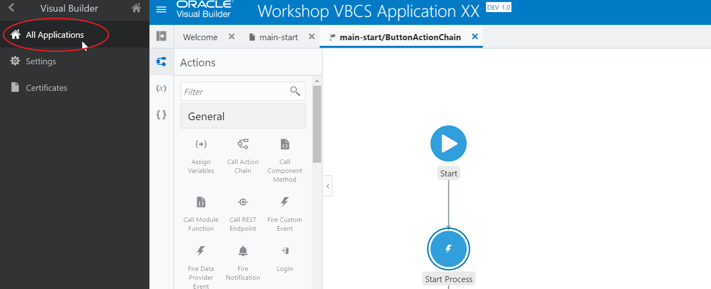

después clic en **Publish**

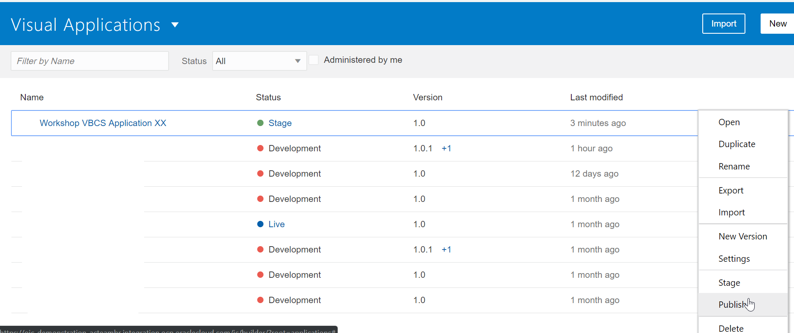

Ahora clic en **Live -> Opportunity** y hacer las pruebas de tu aplicación

Al final de este paso, podrá ver todo el flujo en curso, VBCS llamando a Process Cloud que llama a Integration Cloud. Explore toda la herramienta para aprender y visualizar todo lo que funciona en una sola herramienta.