# Lab 4 - Desenvolvimento de uma tela utilizando o Oracle Visual Builder

## Objetivos
- Passo 1: Criar aplicação VBCS com o formulário para cadastro da oportunidade
- Passo 2: Configurar uma chamada do VBCS para o Oracle Process Cloud
- Passo 3: Criar uma chamada do formulário VBCS para o Oracle Process Cloud
- Passo 4: Efetuar o teste e deploy da aplicação VBCS

## Pré-Requisitos
Leia os Links abaixo:
- Executar o Lab 1 e Lab 2
- Ter acesso ao OIC Enterprise Edition

### Passo 1
**1.1** Faça o login da sua conta no Oracle Ingration Cloud e clique na opção **Visual Builder**.

**1.2** Clique em  **New** para criar uma nova aplicação.

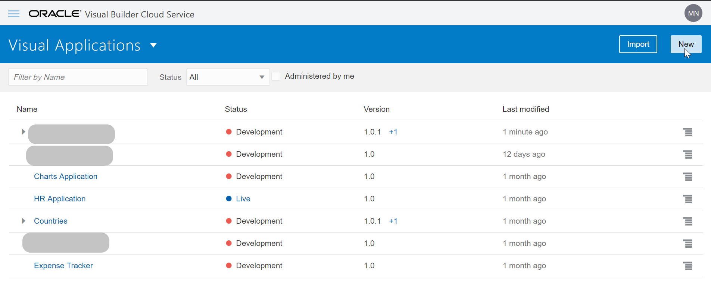

**1.3** Preenche o o campo **Application Name** com `Workshop VBCS Application XX` (Onde XX será entregue pelo instrutor).

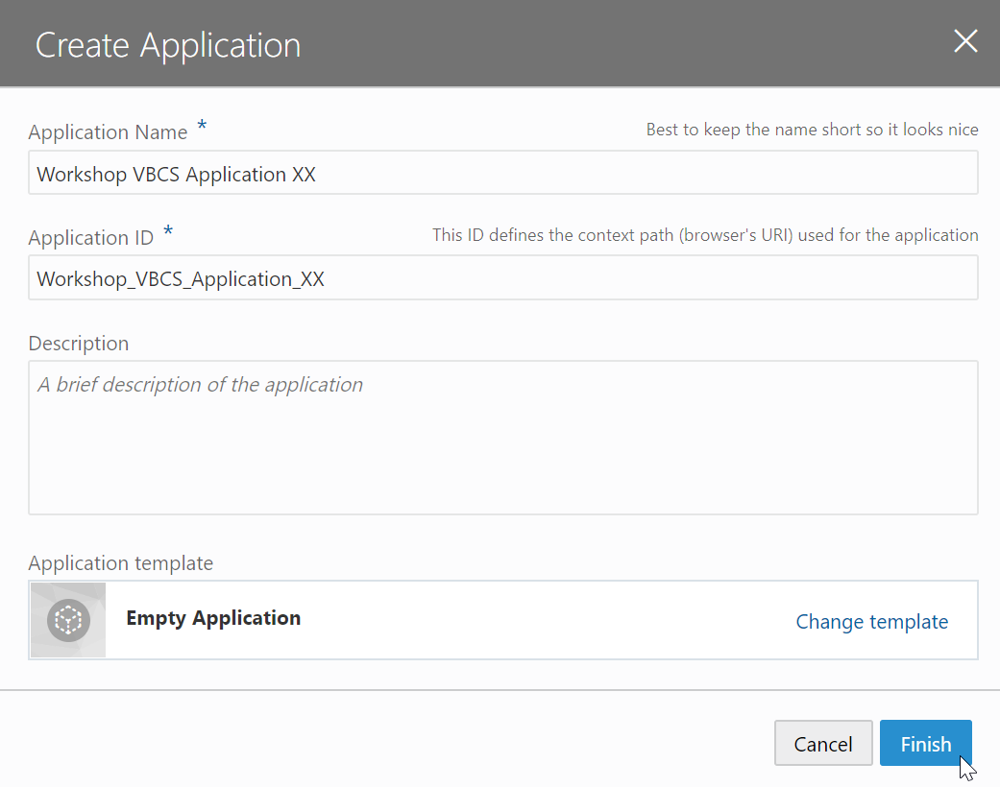

**1.4** Clique em **Web Apps**:

e depois clique em **+ Web Application**, dê o nome de `Opportunity`

**1.5** Após a aplicação criada, ajuste sua tela para uma melhor visualização. No campo **Components** escolha **Layout -> Form Layout** e arraste para o espaço de design. 

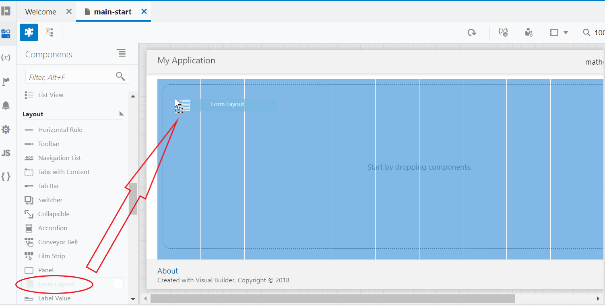

**1.6** Vamos criar os campos de uma oportunidade. Arraste o componente **Field -> Input Text** para dentro do **Form Layout**.

Do lado direito da tela na aba **General** o campo **Label Hint** preencha com `Name`.

**1.7** Crie mais 5 campos dentro do **Form Layout**, para isso repita o 1.6 com os valores da tabela abaixo.

| Componente Field  | Label Hint  |
| ------------ | ------------ |
| Input Text  | Owner |
| Input Text | Product Name  |
| Currency |  Product Price |
| Input Number  |  Product Quantity |
| Percent  |  Win Probability |

Por último adicione um botão no final do formulário, arrastando o componente **Common -> Button**

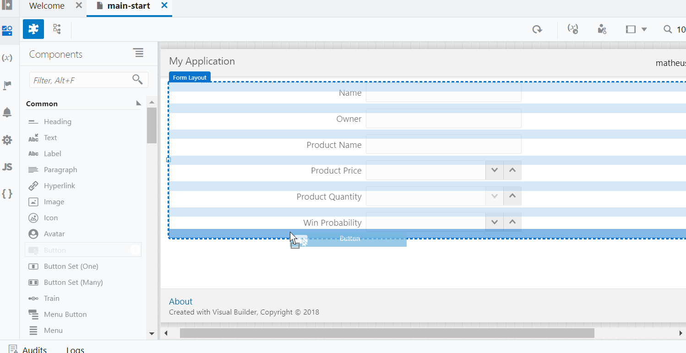

**1.8** Selecione o **Form Layout** na aba **General** selecione no campo **Label Edge** a opção **top**

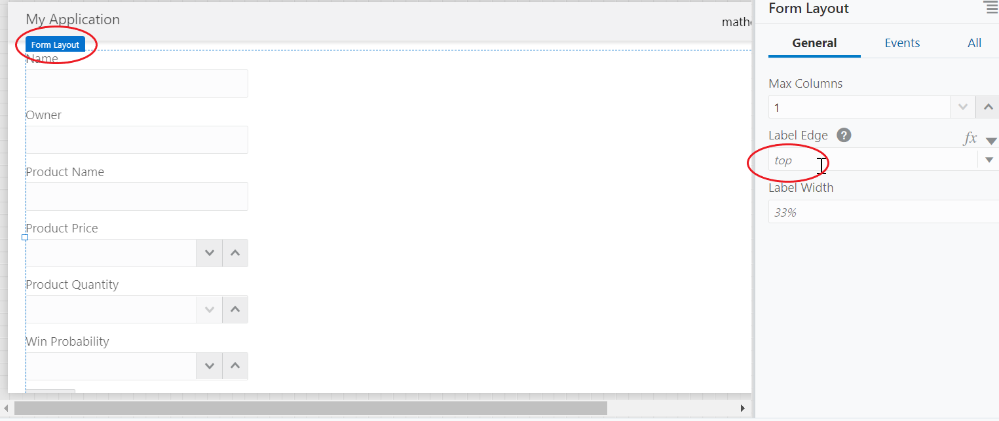

**1.9** Agora vamos criar as variáveis para serem utilizadas nos campos que em
criamos. Para isso siga os passos abaixo: - Cliquem em **Variables** (1) -
- Clique em **Variables** (1)
- Clique em **+ Variable** (2)
- Preencha em **ID** : `Opportunity` (3)
- Preencha em **Type** : `Object` (4)
- Clique em **Create** (5)

**1.10** Clique em **Add Field** e crie os seguintes campos:

| Id  | Type  |
| ------------ | ------------ |
| Name  | String |
| Owner | String  |
| ProductName |  String |
| ProductPrice  |  Number |
| ProductQty  |  Number |
| WinProb  |  Number |

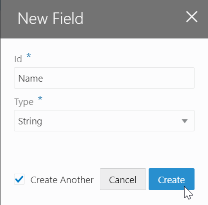

O resultado final ficará próximo a isso:

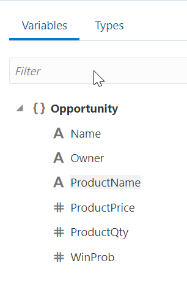

**1.11** Agora vamos associar as variáveis que criamos nos campos da página que criamos. Para isso volte até o design da tela e clique no campo **Name**. Na aba **Data** (1) preencha o campo **Value** (2) com a variável **Name** (3)

Faça o mesmo para o campo **Owner**

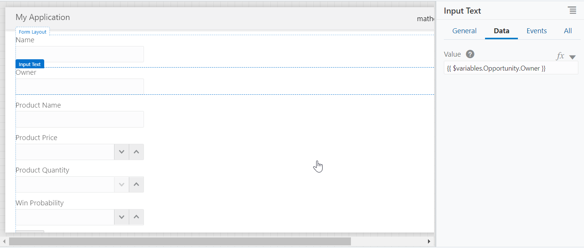

Faça isso para os demais campos:
- Owner
- Product Name
- Product Price
- Product Quantity
- Win Probability

### Passo 2

**2.1** Agora vá no ícone **Process** para criarmos a integração entre o Process Cloud e o VBCS. 

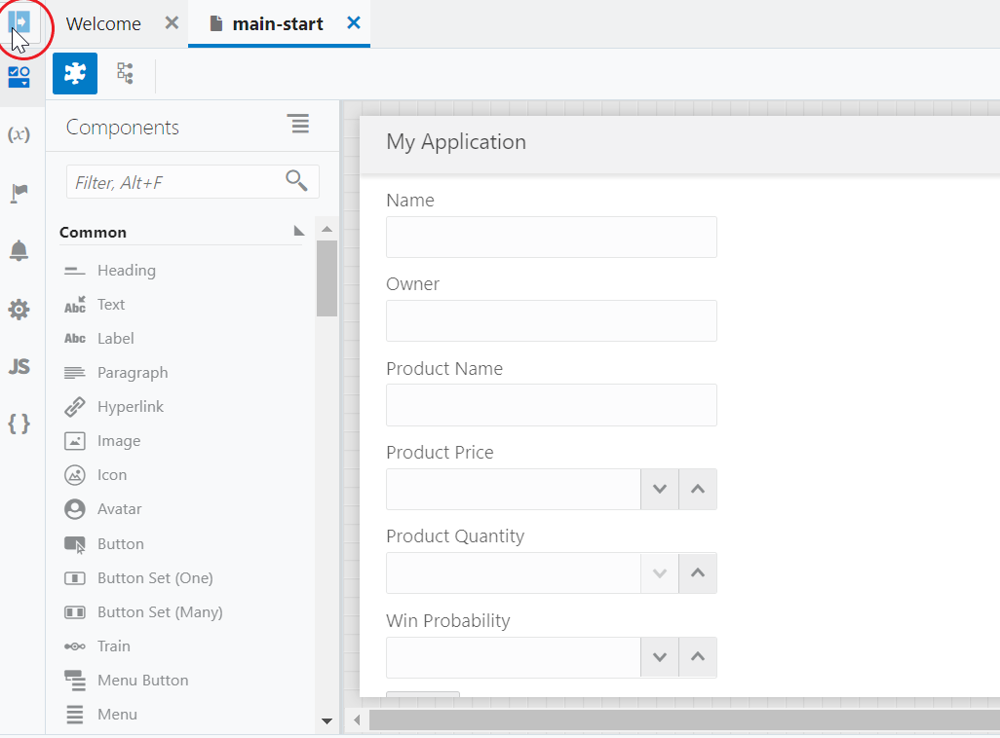

Clique em Process 

Siga os cliques conforme imagem abaixo

**2.2** Clique no **+** para adicionar o processo (1), desligue a opção de incluir testes (2), deixe o **Alias** como `ProcessCreateOpp` (3) e clique em **Add**.

### Passo 3

**3.1** Vamos criar um evento para o botão **Save**. Para isso segui os cliques conforme imagem abaixo:

Clique em **Quick Start: 'ojAction'**

**3.2** Arraste a ação **Start Process** conforme inficado na imagem abaixo:

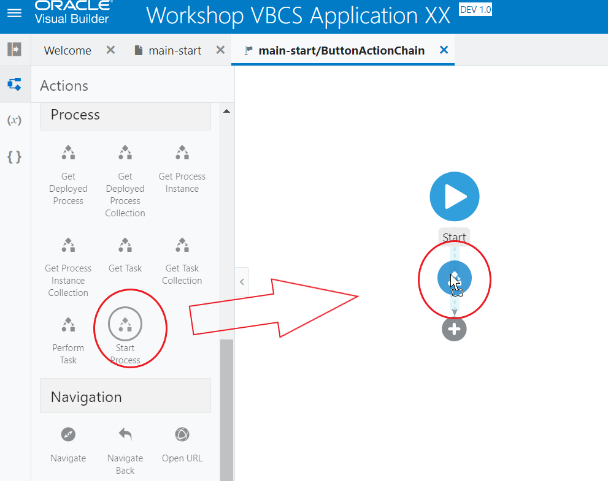

Clique em **Select Process**

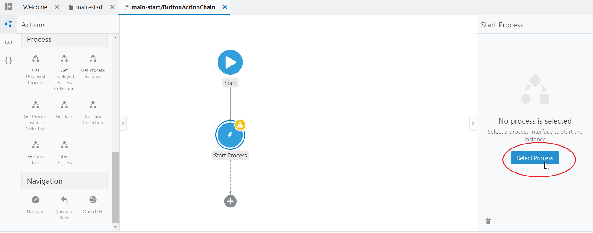

Selecione o processo com o nome do Alias que você deu no passo 2.2

**3.3** Vamos fazer o mapeamento dos campos do formulário com os campos da chamada. Para isso clique em **Assign**

Faça o mapeamento dos campos conforme imagens abaixo:

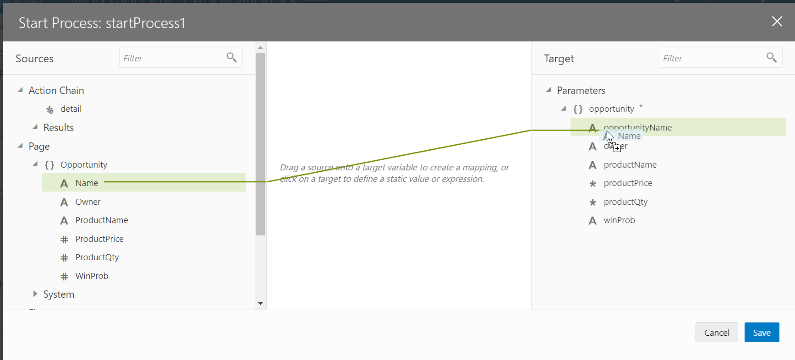

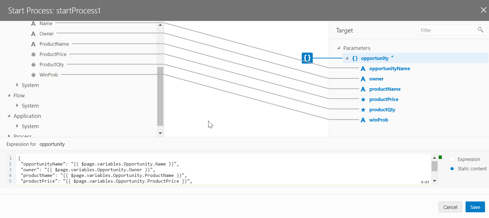

**3.4** Crie mais uma ação chamada **Fire Action** e coloque as informações necessárias conforme imagem abaixo:

### Passo 4

**4.1** Para realizarmos o teste da aplicação, clique no ícone de teste e depois prencha os dados. Conforme images abaixo:

Clique em **Save**

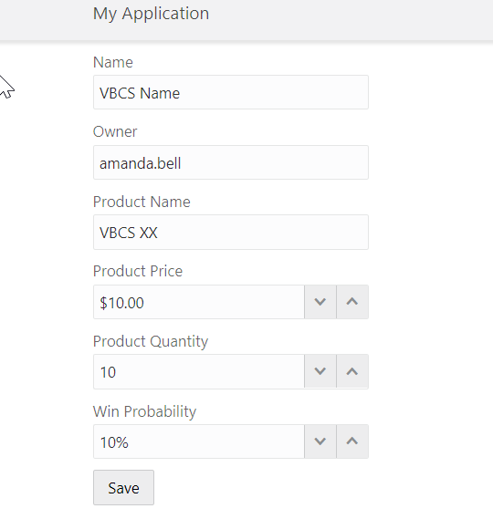

Você deverá receber uma mensagem parecida como esta:

**4.2** Vá até a o integration e pesquisa na **Monitoring** -> **Tracking** (Confome lab 1, passo 4.7) para ver se sua chamada fio feita com sucesso.

**4.3** Agora volte até a tela do Visual Builder e clique em **All Applications** encontre sua aplicação `Workshop VBCS XX` selecione as opções e clique em **Stage**

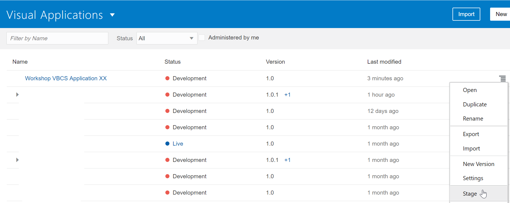

Depois clique em **Publish**

Agora clique em **Live -> Opportunity** e faça os testes de sua aplicação

Com o término deste passo você poderá observar todo o fluxo acontecendo, o VBCS chamando o Process Cloud que chama o Integration Cloud. Navegue por toda a ferramenta para aprender e visualizar tudo funcionando em uma única ferramenta.